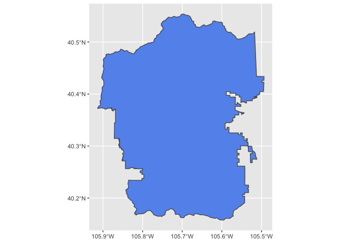

Using Firehose Function
================
Ty Tuff
2022-09-02

# Welcome to the Climate Futures Toolbox’s Firehose function

This vignette provides a walk-through of a common use case of the
Firehose function.

The purpose of the Firehose functions is to download the data as quickly
as possible by distributing tasks across multiple processors. The more
cores you use, the faster this process will go.

Note that the Firehose function is best used for downloading MACA
climate model data for multiple climate variables from multiple climate
models and emission scenarios in their entirety for a **single lat/long
location**. If you want to download data about multiple variables from
multiple models and emission scenarios over a larger geographic region
and a shorter time period, you should use the available_data function. A
vignette about how to use the available_data function is available at
<https://github.com/earthlab/cft/blob/main/vignettes/available-data.md>.

Load the cft package and other libraries required for vignette. If you
need to install cft, install it from CRAN.

``` r
library(cft)
```

    ## Loading required package: plyr

    ## Loading required package: dplyr

    ## 
    ## Attaching package: 'dplyr'

    ## The following objects are masked from 'package:plyr':
    ## 
    ##     arrange, count, desc, failwith, id, mutate, rename, summarise,
    ##     summarize

    ## The following objects are masked from 'package:stats':
    ## 
    ##     filter, lag

    ## The following objects are masked from 'package:base':
    ## 
    ##     intersect, setdiff, setequal, union

    ## Loading required package: osmdata

    ## Data (c) OpenStreetMap contributors, ODbL 1.0. https://www.openstreetmap.org/copyright

    ## Loading required package: magrittr
``` r
library(future)
library(furrr)
library(ggplot2)
```

We will start by setting up our computer to run code on multiple cores
instead of just one. The availableCores() function first checks your
local computer to see how many cores are available and then subtracts
one so that you still have an available core for running your operating
system. The plan() function then starts a back-end structure where tasks
can be assigned. **These backend systems can sometimes have difficulty
shutting down after the process is done, especially if you force quite
an operation in the works. If you find your code stalling without good
explanation, it’s good to restart your computer to clear any of these
structures that may be stuck in memory.**

``` r
n_cores <- availableCores() - 1
plan(multisession, workers = n_cores)
```

We pull all of our data from the internet. Since internet connections
can be a little variable, we try to make a strong link between our
computer and the data server by creating an src object. Run this code to
establish the connection and then use the src object you created to call
on that connection for information. Because this src object is a
connection, it will need to be reconnected each time you want to use it.
You cannot make it once and then use if forever.

``` r
web_link = "https://cida.usgs.gov/thredds/dodsC/macav2metdata_daily_future"

# Change to "https://cida.usgs.gov/thredds/catalog.html?dataset=cida.usgs.gov/macav2metdata_daily_historical" for historical data. 

src <- tidync::tidync(web_link)
```

    ## not a file: 
    ## ' https://cida.usgs.gov/thredds/dodsC/macav2metdata_daily_future '
    ## 
    ## ... attempting remote connection

    ## Connection succeeded.

After a connection is made to the server, we can run the
available_data() function to check that server and see what data it has
available to us. The available_data() function produces three outputs:

1.  a raw list of available data
2.  a table of date times available
3.  a table summarizing available variables and the attributes of those
    variables

Here we print that list of variables. This may take up to a minutes as
you retrieve the information from the server.

``` r
# This is your menu
inputs <- cft::available_data()
```

    ## Trying to connect to the USGS.gov API

    ## not a file: 
    ## ' https://cida.usgs.gov/thredds/dodsC/macav2metdata_daily_future '
    ## 
    ## ... attempting remote connection

    ## Connection succeeded.

    ## Reading results

    ## Converting into an R data.table

``` r
inputs[[1]]
```

    ## # A tibble: 350 × 9
    ##    Available varia…¹ Varia…² Units Model Model…³ Scena…⁴ Varia…⁵ Model…⁶ Scena…⁷
    ##    <chr>             <chr>   <chr> <chr> <chr>   <chr>   <chr>   <chr>   <chr>  
    ##  1 huss_BNU-ESM_r1i… Specif… kg k… Beij… r1i1p1  RCP 4.5 huss    BNU-ESM rcp45  
    ##  2 huss_BNU-ESM_r1i… Specif… kg k… Beij… r1i1p1  RCP 8.5 huss    BNU-ESM rcp85  
    ##  3 huss_CCSM4_r6i1p… Specif… kg k… Comm… r6i1p1  RCP 4.5 huss    CCSM4   rcp45  
    ##  4 huss_CCSM4_r6i1p… Specif… kg k… Comm… r6i1p1  RCP 8.5 huss    CCSM4   rcp85  
    ##  5 huss_CNRM-CM5_r1… Specif… kg k… Cent… r1i1p1  RCP 4.5 huss    CNRM-C… rcp45  
    ##  6 huss_CNRM-CM5_r1… Specif… kg k… Cent… r1i1p1  RCP 8.5 huss    CNRM-C… rcp85  
    ##  7 huss_CSIRO-Mk3-6… Specif… kg k… Comm… r1i1p1  RCP 4.5 huss    CSIRO-… rcp45  
    ##  8 huss_CSIRO-Mk3-6… Specif… kg k… Comm… r1i1p1  RCP 8.5 huss    CSIRO-… rcp85  
    ##  9 huss_CanESM2_r1i… Specif… kg k… Cana… r1i1p1  RCP 4.5 huss    CanESM2 rcp45  
    ## 10 huss_CanESM2_r1i… Specif… kg k… Cana… r1i1p1  RCP 8.5 huss    CanESM2 rcp85  
    ## # … with 340 more rows, and abbreviated variable names ¹​`Available variable`,
    ## #   ²​Variable, ³​`Model ensemble type (only CCSM4 relevant)`, ⁴​Scenario,
    ## #   ⁵​`Variable abbreviation`, ⁶​`Model abbreviation`, ⁷​`Scenario abbreviation`

From the table that was returned, we want to decide which variables we
would like to request. If you are using the Firehose function, you
likely have a long list of variables you’d like to download in their
entirety. Use the
[filter()](https://www.rdocumentation.org/packages/dplyr/versions/0.7.8/topics/filter)
function to select the variables you’d like to download. Store those
choices in an object called input_variables to pass on to the Firehose
function.

``` r
input_variables <- inputs$variable_names %>% 
  filter(Variable %in% c("Maximum Relative Humidity", 
                       "Maximum Temperature", 
                       "Minimum Relative Humidity",          
                       "Minimum Temperature",                 
                       "Precipitation")) %>% 
  filter(Scenario %in% c( "RCP 8.5", "RCP 4.5")) %>% 
  filter(Model %in% c(
    "Beijing Climate Center - Climate System Model 1.1",
    "Beijing Normal University - Earth System Model",
    "Canadian Earth System Model 2",                                                                
  "Centre National de Recherches Météorologiques - Climate Model 5",                              
  "Commonwealth Scientific and Industrial Research Organisation - Mk3.6.0",                       
  "Community Climate System Model 4",                                                             
  "Geophysical Fluid Dynamics Laboratory - Earth System Model 2 Generalized Ocean Layer Dynamics",
  "Geophysical Fluid Dynamics Laboratory - Earth System Model 2 Modular Ocean",                   
  "Hadley Global Environment Model 2 - Climate Chemistry 365 (day) ",                             
 "Hadley Global Environment Model 2 - Earth System 365 (day)",                                   
 "Institut Pierre Simon Laplace (IPSL) - Climate Model 5A - Low Resolution",                     
 "Institut Pierre Simon Laplace (IPSL) - Climate Model 5A - Medium Resolution",                  
 "Institut Pierre Simon Laplace (IPSL) - Climate Model 5B - Low Resolution",                     
 "Institute of Numerical Mathematics Climate Model 4",                                           
 "Meteorological Research Institute - Coupled Global Climate Model 3",                           
 "Model for Interdisciplinary Research On Climate - Earth System Model",                         
 "Model for Interdisciplinary Research On Climate - Earth System Model - Chemistry",             
 "Model for Interdisciplinary Research On Climate 5",                                            
 "Norwegian Earth System Model 1 - Medium Resolution"  )) %>%
  
  pull("Available variable")
```

You can check the object you created to see that it is a list of
formatted variable names ready to send to the server.

``` r
# This is the list of things you would like to order off the menu
input_variables
```

    ##   [1] "pr_BNU-ESM_r1i1p1_rcp45"            "pr_BNU-ESM_r1i1p1_rcp85"           
    ##   [3] "pr_CCSM4_r6i1p1_rcp45"              "pr_CCSM4_r6i1p1_rcp85"             
    ##   [5] "pr_CNRM-CM5_r1i1p1_rcp45"           "pr_CNRM-CM5_r1i1p1_rcp85"          
    ##   [7] "pr_CSIRO-Mk3-6-0_r1i1p1_rcp45"      "pr_CSIRO-Mk3-6-0_r1i1p1_rcp85"     
    ##   [9] "pr_CanESM2_r1i1p1_rcp45"            "pr_CanESM2_r1i1p1_rcp85"           
    ##  [11] "pr_GFDL-ESM2G_r1i1p1_rcp45"         "pr_GFDL-ESM2G_r1i1p1_rcp85"        
    ##  [13] "pr_GFDL-ESM2M_r1i1p1_rcp45"         "pr_GFDL-ESM2M_r1i1p1_rcp85"        
    ##  [15] "pr_HadGEM2-CC365_r1i1p1_rcp45"      "pr_HadGEM2-CC365_r1i1p1_rcp85"     
    ##  [17] "pr_HadGEM2-ES365_r1i1p1_rcp45"      "pr_HadGEM2-ES365_r1i1p1_rcp85"     
    ##  [19] "pr_IPSL-CM5A-LR_r1i1p1_rcp45"       "pr_IPSL-CM5A-LR_r1i1p1_rcp85"      
    ##  [21] "pr_IPSL-CM5A-MR_r1i1p1_rcp45"       "pr_IPSL-CM5A-MR_r1i1p1_rcp85"      
    ##  [23] "pr_IPSL-CM5B-LR_r1i1p1_rcp45"       "pr_IPSL-CM5B-LR_r1i1p1_rcp85"      
    ##  [25] "pr_MIROC-ESM-CHEM_r1i1p1_rcp45"     "pr_MIROC-ESM-CHEM_r1i1p1_rcp85"    
    ##  [27] "pr_MIROC-ESM_r1i1p1_rcp85"          "pr_MIROC-ESM_r1i1p1_rcp45"         
    ##  [29] "pr_MIROC5_r1i1p1_rcp45"             "pr_MIROC5_r1i1p1_rcp85"            
    ##  [31] "pr_MRI-CGCM3_r1i1p1_rcp45"          "pr_MRI-CGCM3_r1i1p1_rcp85"         
    ##  [33] "pr_NorESM1-M_r1i1p1_rcp45"          "pr_NorESM1-M_r1i1p1_rcp85"         
    ##  [35] "pr_bcc-csm1-1_r1i1p1_rcp45"         "pr_bcc-csm1-1_r1i1p1_rcp85"        
    ##  [37] "pr_inmcm4_r1i1p1_rcp45"             "pr_inmcm4_r1i1p1_rcp85"            
    ##  [39] "rhsmax_BNU-ESM_r1i1p1_rcp45"        "rhsmax_BNU-ESM_r1i1p1_rcp85"       
    ##  [41] "rhsmax_CNRM-CM5_r1i1p1_rcp45"       "rhsmax_CNRM-CM5_r1i1p1_rcp85"      
    ##  [43] "rhsmax_CSIRO-Mk3-6-0_r1i1p1_rcp45"  "rhsmax_CSIRO-Mk3-6-0_r1i1p1_rcp85" 
    ##  [45] "rhsmax_CanESM2_r1i1p1_rcp45"        "rhsmax_CanESM2_r1i1p1_rcp85"       
    ##  [47] "rhsmax_GFDL-ESM2G_r1i1p1_rcp45"     "rhsmax_GFDL-ESM2G_r1i1p1_rcp85"    
    ##  [49] "rhsmax_GFDL-ESM2M_r1i1p1_rcp45"     "rhsmax_HadGEM2-CC365_r1i1p1_rcp45" 
    ##  [51] "rhsmax_HadGEM2-CC365_r1i1p1_rcp85"  "rhsmax_HadGEM2-ES365_r1i1p1_rcp45" 
    ##  [53] "rhsmax_HadGEM2-ES365_r1i1p1_rcp85"  "rhsmax_IPSL-CM5A-LR_r1i1p1_rcp45"  
    ##  [55] "rhsmax_IPSL-CM5A-LR_r1i1p1_rcp85"   "rhsmax_IPSL-CM5A-MR_r1i1p1_rcp45"  
    ##  [57] "rhsmax_IPSL-CM5A-MR_r1i1p1_rcp85"   "rhsmax_IPSL-CM5B-LR_r1i1p1_rcp45"  
    ##  [59] "rhsmax_IPSL-CM5B-LR_r1i1p1_rcp85"   "rhsmax_MIROC-ESM-CHEM_r1i1p1_rcp45"
    ##  [61] "rhsmax_MIROC-ESM-CHEM_r1i1p1_rcp85" "rhsmax_MIROC-ESM_r1i1p1_rcp45"     
    ##  [63] "rhsmax_MIROC-ESM_r1i1p1_rcp85"      "rhsmax_MIROC5_r1i1p1_rcp45"        
    ##  [65] "rhsmax_MIROC5_r1i1p1_rcp85"         "rhsmax_MRI-CGCM3_r1i1p1_rcp45"     
    ##  [67] "rhsmax_MRI-CGCM3_r1i1p1_rcp85"      "rhsmax_bcc-csm1-1_r1i1p1_rcp45"    
    ##  [69] "rhsmax_bcc-csm1-1_r1i1p1_rcp85"     "rhsmax_inmcm4_r1i1p1_rcp45"        
    ##  [71] "rhsmax_inmcm4_r1i1p1_rcp85"         "rhsmin_BNU-ESM_r1i1p1_rcp45"       
    ##  [73] "rhsmin_BNU-ESM_r1i1p1_rcp85"        "rhsmin_CNRM-CM5_r1i1p1_rcp45"      
    ##  [75] "rhsmin_CNRM-CM5_r1i1p1_rcp85"       "rhsmin_CSIRO-Mk3-6-0_r1i1p1_rcp45" 
    ##  [77] "rhsmin_CSIRO-Mk3-6-0_r1i1p1_rcp85"  "rhsmin_CanESM2_r1i1p1_rcp45"       
    ##  [79] "rhsmin_CanESM2_r1i1p1_rcp85"        "rhsmin_GFDL-ESM2G_r1i1p1_rcp45"    
    ##  [81] "rhsmin_GFDL-ESM2G_r1i1p1_rcp85"     "rhsmin_GFDL-ESM2M_r1i1p1_rcp45"    
    ##  [83] "rhsmin_GFDL-ESM2M_r1i1p1_rcp85"     "rhsmin_HadGEM2-CC365_r1i1p1_rcp45" 
    ##  [85] "rhsmin_HadGEM2-CC365_r1i1p1_rcp85"  "rhsmin_HadGEM2-ES365_r1i1p1_rcp45" 
    ##  [87] "rhsmin_HadGEM2-ES365_r1i1p1_rcp85"  "rhsmin_IPSL-CM5A-LR_r1i1p1_rcp45"  
    ##  [89] "rhsmin_IPSL-CM5A-LR_r1i1p1_rcp85"   "rhsmin_IPSL-CM5A-MR_r1i1p1_rcp45"  
    ##  [91] "rhsmin_IPSL-CM5A-MR_r1i1p1_rcp85"   "rhsmin_IPSL-CM5B-LR_r1i1p1_rcp45"  
    ##  [93] "rhsmin_IPSL-CM5B-LR_r1i1p1_rcp85"   "rhsmin_MIROC-ESM-CHEM_r1i1p1_rcp45"
    ##  [95] "rhsmin_MIROC-ESM-CHEM_r1i1p1_rcp85" "rhsmin_MIROC-ESM_r1i1p1_rcp45"     
    ##  [97] "rhsmin_MIROC-ESM_r1i1p1_rcp85"      "rhsmin_MIROC5_r1i1p1_rcp45"        
    ##  [99] "rhsmin_MIROC5_r1i1p1_rcp85"         "rhsmin_MRI-CGCM3_r1i1p1_rcp45"     
    ## [101] "rhsmin_MRI-CGCM3_r1i1p1_rcp85"      "rhsmin_bcc-csm1-1_r1i1p1_rcp45"    
    ## [103] "rhsmin_bcc-csm1-1_r1i1p1_rcp85"     "rhsmin_inmcm4_r1i1p1_rcp45"        
    ## [105] "rhsmin_inmcm4_r1i1p1_rcp85"         "tasmax_BNU-ESM_r1i1p1_rcp45"       
    ## [107] "tasmax_BNU-ESM_r1i1p1_rcp85"        "tasmax_CCSM4_r6i1p1_rcp45"         
    ## [109] "tasmax_CCSM4_r6i1p1_rcp85"          "tasmax_CNRM-CM5_r1i1p1_rcp45"      
    ## [111] "tasmax_CNRM-CM5_r1i1p1_rcp85"       "tasmax_CSIRO-Mk3-6-0_r1i1p1_rcp45" 
    ## [113] "tasmax_CSIRO-Mk3-6-0_r1i1p1_rcp85"  "tasmax_CanESM2_r1i1p1_rcp45"       
    ## [115] "tasmax_CanESM2_r1i1p1_rcp85"        "tasmax_GFDL-ESM2G_r1i1p1_rcp45"    
    ## [117] "tasmax_GFDL-ESM2G_r1i1p1_rcp85"     "tasmax_GFDL-ESM2M_r1i1p1_rcp45"    
    ## [119] "tasmax_GFDL-ESM2M_r1i1p1_rcp85"     "tasmax_HadGEM2-CC365_r1i1p1_rcp45" 
    ## [121] "tasmax_HadGEM2-CC365_r1i1p1_rcp85"  "tasmax_HadGEM2-ES365_r1i1p1_rcp45" 
    ## [123] "tasmax_HadGEM2-ES365_r1i1p1_rcp85"  "tasmax_IPSL-CM5A-LR_r1i1p1_rcp45"  
    ## [125] "tasmax_IPSL-CM5A-LR_r1i1p1_rcp85"   "tasmax_IPSL-CM5A-MR_r1i1p1_rcp45"  
    ## [127] "tasmax_IPSL-CM5A-MR_r1i1p1_rcp85"   "tasmax_IPSL-CM5B-LR_r1i1p1_rcp45"  
    ## [129] "tasmax_IPSL-CM5B-LR_r1i1p1_rcp85"   "tasmax_MIROC-ESM-CHEM_r1i1p1_rcp45"
    ## [131] "tasmax_MIROC-ESM-CHEM_r1i1p1_rcp85" "tasmax_MIROC-ESM_r1i1p1_rcp45"     
    ## [133] "tasmax_MIROC-ESM_r1i1p1_rcp85"      "tasmax_MIROC5_r1i1p1_rcp45"        
    ## [135] "tasmax_MIROC5_r1i1p1_rcp85"         "tasmax_MRI-CGCM3_r1i1p1_rcp45"     
    ## [137] "tasmax_MRI-CGCM3_r1i1p1_rcp85"      "tasmax_NorESM1-M_r1i1p1_rcp45"     
    ## [139] "tasmax_NorESM1-M_r1i1p1_rcp85"      "tasmax_bcc-csm1-1_r1i1p1_rcp45"    
    ## [141] "tasmax_bcc-csm1-1_r1i1p1_rcp85"     "tasmax_inmcm4_r1i1p1_rcp45"        
    ## [143] "tasmax_inmcm4_r1i1p1_rcp85"         "tasmin_BNU-ESM_r1i1p1_rcp45"       
    ## [145] "tasmin_BNU-ESM_r1i1p1_rcp85"        "tasmin_CCSM4_r6i1p1_rcp45"         
    ## [147] "tasmin_CCSM4_r6i1p1_rcp85"          "tasmin_CNRM-CM5_r1i1p1_rcp45"      
    ## [149] "tasmin_CNRM-CM5_r1i1p1_rcp85"       "tasmin_CSIRO-Mk3-6-0_r1i1p1_rcp45" 
    ## [151] "tasmin_CSIRO-Mk3-6-0_r1i1p1_rcp85"  "tasmin_CanESM2_r1i1p1_rcp45"       
    ## [153] "tasmin_CanESM2_r1i1p1_rcp85"        "tasmin_GFDL-ESM2G_r1i1p1_rcp45"    
    ## [155] "tasmin_GFDL-ESM2G_r1i1p1_rcp85"     "tasmin_GFDL-ESM2M_r1i1p1_rcp45"    
    ## [157] "tasmin_GFDL-ESM2M_r1i1p1_rcp85"     "tasmin_HadGEM2-CC365_r1i1p1_rcp45" 
    ## [159] "tasmin_HadGEM2-CC365_r1i1p1_rcp85"  "tasmin_HadGEM2-ES365_r1i1p1_rcp45" 
    ## [161] "tasmin_HadGEM2-ES365_r1i1p1_rcp85"  "tasmin_IPSL-CM5A-LR_r1i1p1_rcp45"  
    ## [163] "tasmin_IPSL-CM5A-LR_r1i1p1_rcp85"   "tasmin_IPSL-CM5A-MR_r1i1p1_rcp45"  
    ## [165] "tasmin_IPSL-CM5A-MR_r1i1p1_rcp85"   "tasmin_IPSL-CM5B-LR_r1i1p1_rcp45"  
    ## [167] "tasmin_IPSL-CM5B-LR_r1i1p1_rcp85"   "tasmin_MIROC-ESM-CHEM_r1i1p1_rcp45"
    ## [169] "tasmin_MIROC-ESM-CHEM_r1i1p1_rcp85" "tasmin_MIROC-ESM_r1i1p1_rcp45"     
    ## [171] "tasmin_MIROC-ESM_r1i1p1_rcp85"      "tasmin_MIROC5_r1i1p1_rcp45"        
    ## [173] "tasmin_MIROC5_r1i1p1_rcp85"         "tasmin_MRI-CGCM3_r1i1p1_rcp45"     
    ## [175] "tasmin_MRI-CGCM3_r1i1p1_rcp85"      "tasmin_NorESM1-M_r1i1p1_rcp45"     
    ## [177] "tasmin_NorESM1-M_r1i1p1_rcp85"      "tasmin_bcc-csm1-1_r1i1p1_rcp45"    
    ## [179] "tasmin_bcc-csm1-1_r1i1p1_rcp85"     "tasmin_inmcm4_r1i1p1_rcp45"        
    ## [181] "tasmin_inmcm4_r1i1p1_rcp85"

# Set your area of interest

The Firehose function downloads all the requested variables, for all
available time points, for a SINGLE geographic location. The underlying
data are summarized to points on a grid and don’t include every
conceivable point you could enter. You need to first suggest a lat/long
pair and then find the aggregated download point that is closest to your
suggested point. In the code here, we use Open Street Map to download a
polygon for Rocky Mountain National Park and then find the centroid as
our suggested point.

``` r
aoi_name <- "colorado"
bb <- getbb(aoi_name)
my_boundary <- opq(bb, timeout=300) %>%
  add_osm_feature(key = "boundary", value = "national_park") %>%
  osmdata_sf()

my_boundary
my_boundary$osm_multipolygons
```

    ## Simple feature collection with 14 features and 42 fields
    ## Geometry type: MULTIPOLYGON
    ## Dimension:     XY
    ## Bounding box:  xmin: -109.3377 ymin: 36.28472 xmax: -103.4169 ymax: 40.74693
    ## Geodetic CRS:  WGS 84
    ## First 10 features:
    ##          osm_id                                       name
    ## 390960   390960               Rocky Mountain National Park
    ## 395552   395552 Black Canyon of the Gunnison National Park
    ## 395555   395555         Curecanti National Recreation Area
    ## 5453168 5453168                 Colorado National Monument
    ## 5725308 5725308             Great Sand Dunes National Park
    ## 5725309 5725309         Great Sand Dunes National Preserve
    ## 5749022 5749022            Browns Canyon National Monument
    ## 5749060 5749060   Florissant Fossil Beds National Monument
    ## 5749153 5749153                 Dinosaur National Monument
    ## 5749169 5749169              Yucca House National Monument
    ##                   attribution      boundary  boundary.type  ele gnis.county_id
    ## 390960  National Park Service national_park protected_area                    
    ## 395552  National Park Service national_park                2045            085
    ## 395555  National Park Service national_park protected_area                    
    ## 5453168                       national_park                                   
    ## 5725308 National Park Service national_park protected_area 2590            109
    ## 5725309 National Park Service national_park protected_area                    
    ## 5749022                       national_park protected_area                    
    ## 5749060                       national_park                                   
    ## 5749153                       national_park                                   
    ## 5749169                       national_park                                   
    ##         gnis.created gnis.feature_id gnis.state_id heritage heritage.operator
    ## 390960                                                                       
    ## 395552    10/13/1978          203271            08                           
    ## 395555                                                                       
    ## 5453168                                                                      
    ## 5725308   08/31/1992          192558            08                           
    ## 5725309                                                                      
    ## 5749022                                                                      
    ## 5749060                                                                      
    ## 5749153                                                                      
    ## 5749169                       202628                                         
    ##                leisure name.ar name.de name.en name.es name.fr name.ja name.nl
    ## 390960                                                                        
    ## 395552  nature_reserve                                                        
    ## 395555  nature_reserve                                                        
    ## 5453168 nature_reserve                                                        
    ## 5725308 nature_reserve                                                        
    ## 5725309 nature_reserve                                                        
    ## 5749022 nature_reserve                                                        
    ## 5749060 nature_reserve                                                        
    ## 5749153 nature_reserve                                                        
    ## 5749169                                                                       
    ##         name.ru name.zh                            operator operator.short
    ## 390960                                National Park Service            NPS
    ## 395552                  United States National Park Service               
    ## 395555                                National Park Service            NPS
    ## 5453168                                                                   
    ## 5725308                               National Park Service            NPS
    ## 5725309                               National Park Service            NPS
    ## 5749022                                            BLM;USFS               
    ## 5749060                 United States National Park Service               
    ## 5749153                 United States National Park Service               
    ## 5749169                 United States National Park Service               
    ##         operator.type operator.wikidata       operator.wikipedia ownership
    ## 390960         public           Q308439 en:National Park Service  national
    ## 395552                                                            national
    ## 395555         public           Q308439                           national
    ## 5453168                                                           national
    ## 5725308        public           Q308439 en:National Park Service  national
    ## 5725309        public           Q308439 en:National Park Service  national
    ## 5749022                                                           national
    ## 5749060                                                           national
    ## 5749153                                                           national
    ## 5749169                                                           national
    ##         protect_class protect_id protect_title  protected
    ## 390960              2          2 National Park perpetuity
    ## 395552                         2               perpetuity
    ## 395555              5                          perpetuity
    ## 5453168             3                          perpetuity
    ## 5725308                        2               perpetuity
    ## 5725309                        2               perpetuity
    ## 5749022             3                          perpetuity
    ## 5749060             5                                    
    ## 5749153             3                                    
    ## 5749169            22                                    
    ##                 protection_title ref.whc
    ## 390960             National Park        
    ## 395552             National Park        
    ## 395555  National Recreation Area        
    ## 5453168        National Monument        
    ## 5725308            National Park        
    ## 5725309        National Preserve        
    ## 5749022        National Monument        
    ## 5749060        National Monument        
    ## 5749153        National Monument        
    ## 5749169        National Monument        
    ##                                                                  source
    ## 390960                                                                 
    ## 395552                                                                 
    ## 395555                   http://science.nature.nps.gov/im/gis/index.cfm
    ## 5453168 http://science.nature.nps.gov/im/gis/index.cfm;en.wikipedia.org
    ## 5725308                                                                
    ## 5725309                                                                
    ## 5749022                                                                
    ## 5749060                                                                
    ## 5749153                                                                
    ## 5749169                                                                
    ##         source.geometry     type                            website
    ## 390960                  boundary           http://www.nps.gov/romo/
    ## 395552                  boundary                                   
    ## 395555                  boundary                                   
    ## 5453168                 boundary https://www.nps.gov/colm/index.htm
    ## 5725308                 boundary                                   
    ## 5725309                 boundary                                   
    ## 5749022                 boundary                                   
    ## 5749060                 boundary https://www.nps.gov/flfo/index.htm
    ## 5749153                 boundary https://www.nps.gov/dino/index.htm
    ## 5749169                 boundary           http://www.nps.gov/yuho/
    ##         whc.criteria whc.inscription_date wikidata
    ## 390960                                     Q777183
    ## 395552                                     Q305880
    ## 395555                                            
    ## 5453168                                   Q1111312
    ## 5725308                                    Q609097
    ## 5725309                                    Q609097
    ## 5749022                                           
    ## 5749060                                   Q1430179
    ## 5749153                                   Q1226698
    ## 5749169                                    Q602414
    ##                                              wikipedia
    ## 390960                 en:Rocky Mountain National Park
    ## 395552   en:Black Canyon of the Gunnison National Park
    ## 395555                                                
    ## 5453168                  en:Colorado National Monument
    ## 5725308 en:Great Sand Dunes National Park and Preserve
    ## 5725309 en:Great Sand Dunes National Park and Preserve
    ## 5749022                                               
    ## 5749060    en:Florissant Fossil Beds National Monument
    ## 5749153                  en:Dinosaur National Monument
    ## 5749169               en:Yucca House National Monument
    ##                               geometry
    ## 390960  MULTIPOLYGON (((-105.7615 4...
    ## 395552  MULTIPOLYGON (((-107.8019 3...
    ## 395555  MULTIPOLYGON (((-107.6507 3...
    ## 5453168 MULTIPOLYGON (((-108.7384 3...
    ## 5725308 MULTIPOLYGON (((-105.517 37...
    ## 5725309 MULTIPOLYGON (((-105.5522 3...
    ## 5749022 MULTIPOLYGON (((-105.9675 3...
    ## 5749060 MULTIPOLYGON (((-105.2509 3...
    ## 5749153 MULTIPOLYGON (((-108.9678 4...
    ## 5749169 MULTIPOLYGON (((-108.6855 3...

``` r
my_boundary$osm_multipolygons[1,]
```

    ## Simple feature collection with 1 feature and 42 fields
    ## Geometry type: MULTIPOLYGON
    ## Dimension:     XY
    ## Bounding box:  xmin: -105.9137 ymin: 40.15777 xmax: -105.4936 ymax: 40.55379
    ## Geodetic CRS:  WGS 84
    ##        osm_id                         name           attribution      boundary
    ## 390960 390960 Rocky Mountain National Park National Park Service national_park
    ##         boundary.type ele gnis.county_id gnis.created gnis.feature_id
    ## 390960 protected_area                                                
    ##        gnis.state_id heritage heritage.operator leisure name.ar name.de name.en
    ## 390960                                                                         
    ##        name.es name.fr name.ja name.nl name.ru name.zh              operator
    ## 390960                                                 National Park Service
    ##        operator.short operator.type operator.wikidata       operator.wikipedia
    ## 390960            NPS        public           Q308439 en:National Park Service
    ##        ownership protect_class protect_id protect_title  protected
    ## 390960  national             2          2 National Park perpetuity
    ##        protection_title ref.whc source source.geometry     type
    ## 390960    National Park                                boundary
    ##                         website whc.criteria whc.inscription_date wikidata
    ## 390960 http://www.nps.gov/romo/                                    Q777183
    ##                              wikipedia                       geometry
    ## 390960 en:Rocky Mountain National Park MULTIPOLYGON (((-105.7615 4...

``` r
boundaries <- my_boundary$osm_multipolygons[1,] 
```

``` r
ggplot() +
  geom_sf(data = boundaries, fill = "cornflowerblue") 
```

<!-- -->

``` r
pulled_bb <-  st_bbox(boundaries)
pulled_bb
```

    ##       xmin       ymin       xmax       ymax 
    ## -105.91371   40.15777 -105.49358   40.55379

``` r
pt <- st_coordinates(st_centroid(boundaries))
```

    ## Warning in st_centroid.sf(boundaries): st_centroid assumes attributes are
    ## constant over geometries of x

So, our suggested point is pt.

``` r
pt
```

    ##           X        Y
    ## 1 -105.6973 40.35543

Now we can check to see which point in the dataset most closely
resembles our suggested point.

``` r
lat_pt <- pt[1,2]
lon_pt <- pt[1,1]

lons <- src %>% activate("D2") %>% hyper_tibble()
lats <- src %>% activate("D1") %>% hyper_tibble()

known_lon <- lons[which(abs(lons-lon_pt)==min(abs(lons-lon_pt))),]
known_lat <- lats[which(abs(lats-lat_pt)==min(abs(lats-lat_pt))),]


chosen_pt <- st_as_sf(cbind(known_lon,known_lat), coords = c("lon", "lat"), crs = "WGS84", agr = "constant")
```

The chosen point is relatively close to the suggested point.

``` r
chosen_pt
```

    ## Simple feature collection with 1 feature and 0 fields
    ## Geometry type: POINT
    ## Dimension:     XY
    ## Bounding box:  xmin: -105.6891 ymin: 40.3545 xmax: -105.6891 ymax: 40.3545
    ## Geodetic CRS:  WGS 84
    ##                    geometry
    ## 1 POINT (-105.6891 40.3545)

A plot of the suggested point and the available point next to eachother
for perspective. You can see that there is an available data slice very
near our suggested point.

``` r
ggplot() +
  geom_sf(data = boundaries, fill = "cornflowerblue") +
  geom_sf(data = st_centroid(boundaries), color = "red", size=0.5) +
  geom_sf(data = chosen_pt, color = "green", size=0.5)
```

    ## Warning in st_centroid.sf(boundaries): st_centroid assumes attributes are
    ## constant over geometries of x

<!-- -->

# Run the Firehose function

You will need to supply the Firehose function with three things for it
to work properly:

1.  a parallelization object produced by the plan() function to specify
    how many cores you want the function to use
2.  an input_variable object specifying the properly formatted list of
    variables you want to download
3.  the latitude and longitude coordinates for the available data point
    you want to extract

Provide those three things to the single_point_firehose() function and
it will download your data as fast as possible, organize those data into
an sf spatial dataframe, and return that dataframe.

**Some notes of caution.**

When you use numerous cores to make a lot of simultaneous requests, the
server occasionally mistakes you for a DDOS attack and kills your
connection. The firehose function deals with this uncertainty, and other
forms of network disruption, by conducting two phases of downloads. It
first tries to download everything you requested through a ton of
independent api requests, it then scans all of the downloads to see
which ones failed and organizes a follow-up download run to recapture
downloads that failed on your first attempt. Do not worry if you see the
progress bar get disrupted during either one of these passes, it will
hopefully capture all of the errors and retry those downloads.

This function will run faster if you provide it more cores and a faster
internet connection. In our test runs with 11 cores on a 12 core laptop
and 800 MB/s internet it took 40-80 minutes to download 181 variables.
The variance was largely driven by our network connection speed and
error rate (because they require a second try to download).

``` r
out <- single_point_firehose(input_variables, known_lat, known_lon )
```

    ## Trying to connect to the USGS.gov API

    ## not a file: 
    ## ' https://cida.usgs.gov/thredds/dodsC/macav2metdata_daily_future '
    ## 
    ## ... attempting remote connection

    ## Connection succeeded.

    ## Error in Rsx_nc4_get_vara_int: NetCDF: DAP failure
    ## Var: pr_BNU-ESM_r1i1p1_rcp85  Ndims: 3   Start: 0,367,458 Count: 34333,1,1
    ## Error in Rsx_nc4_get_vara_int: NetCDF: DAP failure
    ## Var: pr_CCSM4_r6i1p1_rcp45  Ndims: 3   Start: 0,367,458 Count: 34333,1,1
    ## Error in Rsx_nc4_get_vara_int: NetCDF: DAP failure
    ## Var: pr_CCSM4_r6i1p1_rcp85  Ndims: 3   Start: 0,367,458 Count: 34333,1,1
    ## Error in Rsx_nc4_get_vara_int: NetCDF: DAP failure
    ## Var: pr_CNRM-CM5_r1i1p1_rcp45  Ndims: 3   Start: 0,367,458 Count: 34333,1,1
    ## Error in Rsx_nc4_get_vara_int: NetCDF: DAP failure
    ## Var: pr_CNRM-CM5_r1i1p1_rcp85  Ndims: 3   Start: 0,367,458 Count: 34333,1,1
    ## Error in Rsx_nc4_get_vara_int: NetCDF: DAP failure
    ## Var: pr_CSIRO-Mk3-6-0_r1i1p1_rcp45  Ndims: 3   Start: 0,367,458 Count: 34333,1,1
    ## Error in Rsx_nc4_get_vara_int: NetCDF: DAP failure
    ## Var: pr_CSIRO-Mk3-6-0_r1i1p1_rcp85  Ndims: 3   Start: 0,367,458 Count: 34333,1,1
    ## Error in Rsx_nc4_get_vara_int: NetCDF: DAP failure
    ## Var: pr_CanESM2_r1i1p1_rcp45  Ndims: 3   Start: 0,367,458 Count: 34333,1,1
    ## Error in Rsx_nc4_get_vara_int: NetCDF: DAP failure
    ## Var: pr_CanESM2_r1i1p1_rcp85  Ndims: 3   Start: 0,367,458 Count: 34333,1,1
    ## Error in Rsx_nc4_get_vara_int: NetCDF: DAP failure
    ## Var: pr_GFDL-ESM2G_r1i1p1_rcp45  Ndims: 3   Start: 0,367,458 Count: 34333,1,1
    ## Error in Rsx_nc4_get_vara_int: NetCDF: DAP failure
    ## Var: pr_GFDL-ESM2G_r1i1p1_rcp85  Ndims: 3   Start: 0,367,458 Count: 34333,1,1

    ## not a file: 
    ## ' https://cida.usgs.gov/thredds/dodsC/macav2metdata_daily_future '
    ## 
    ## ... attempting remote connection
    ## 
    ## Connection succeeded.

    ## not a file: 
    ## ' https://cida.usgs.gov/thredds/dodsC/macav2metdata_daily_future '
    ## 
    ## ... attempting remote connection

    ## Connection succeeded.

    ## not a file: 
    ## ' https://cida.usgs.gov/thredds/dodsC/macav2metdata_daily_future '
    ## 
    ## ... attempting remote connection

    ## Connection succeeded.

    ## not a file: 
    ## ' https://cida.usgs.gov/thredds/dodsC/macav2metdata_daily_future '
    ## 
    ## ... attempting remote connection

    ## Connection succeeded.

    ## not a file: 
    ## ' https://cida.usgs.gov/thredds/dodsC/macav2metdata_daily_future '
    ## 
    ## ... attempting remote connection

    ## Connection succeeded.

    ## not a file: 
    ## ' https://cida.usgs.gov/thredds/dodsC/macav2metdata_daily_future '
    ## 
    ## ... attempting remote connection

    ## Connection succeeded.

    ## not a file: 
    ## ' https://cida.usgs.gov/thredds/dodsC/macav2metdata_daily_future '
    ## 
    ## ... attempting remote connection

    ## Connection succeeded.

    ## not a file: 
    ## ' https://cida.usgs.gov/thredds/dodsC/macav2metdata_daily_future '
    ## 
    ## ... attempting remote connection

    ## Connection succeeded.

    ## not a file: 
    ## ' https://cida.usgs.gov/thredds/dodsC/macav2metdata_daily_future '
    ## 
    ## ... attempting remote connection

    ## Connection succeeded.

    ## not a file: 
    ## ' https://cida.usgs.gov/thredds/dodsC/macav2metdata_daily_future '
    ## 
    ## ... attempting remote connection

    ## Connection succeeded.

    ## not a file: 
    ## ' https://cida.usgs.gov/thredds/dodsC/macav2metdata_daily_future '
    ## 
    ## ... attempting remote connection

    ## Connection succeeded.

    ## not a file: 
    ## ' https://cida.usgs.gov/thredds/dodsC/macav2metdata_daily_future '
    ## 
    ## ... attempting remote connection

    ## Connection succeeded.

    ## Error in Rsx_nc4_get_vara_int: NetCDF: DAP failure
    ## Var: pr_GFDL-ESM2M_r1i1p1_rcp45  Ndims: 3   Start: 0,367,458 Count: 34333,1,1
    ## Error in Rsx_nc4_get_vara_int: NetCDF: DAP failure
    ## Var: pr_GFDL-ESM2M_r1i1p1_rcp85  Ndims: 3   Start: 0,367,458 Count: 34333,1,1
    ## Error in Rsx_nc4_get_vara_int: NetCDF: DAP failure
    ## Var: pr_HadGEM2-CC365_r1i1p1_rcp45  Ndims: 3   Start: 0,367,458 Count: 34333,1,1
    ## Error in Rsx_nc4_get_vara_int: NetCDF: DAP failure
    ## Var: pr_HadGEM2-CC365_r1i1p1_rcp85  Ndims: 3   Start: 0,367,458 Count: 34333,1,1
    ## Error in Rsx_nc4_get_vara_int: NetCDF: DAP failure
    ## Var: pr_HadGEM2-ES365_r1i1p1_rcp45  Ndims: 3   Start: 0,367,458 Count: 34333,1,1
    ## Error in Rsx_nc4_get_vara_int: NetCDF: DAP failure
    ## Var: pr_HadGEM2-ES365_r1i1p1_rcp85  Ndims: 3   Start: 0,367,458 Count: 34333,1,1
    ## Error in Rsx_nc4_get_vara_int: NetCDF: DAP failure
    ## Var: pr_IPSL-CM5A-LR_r1i1p1_rcp45  Ndims: 3   Start: 0,367,458 Count: 34333,1,1
    ## Error in Rsx_nc4_get_vara_int: NetCDF: DAP failure
    ## Var: pr_IPSL-CM5A-LR_r1i1p1_rcp85  Ndims: 3   Start: 0,367,458 Count: 34333,1,1
    ## Error in Rsx_nc4_get_vara_int: NetCDF: DAP failure
    ## Var: pr_IPSL-CM5A-MR_r1i1p1_rcp45  Ndims: 3   Start: 0,367,458 Count: 34333,1,1
    ## Error in Rsx_nc4_get_vara_int: NetCDF: DAP failure
    ## Var: pr_IPSL-CM5A-MR_r1i1p1_rcp85  Ndims: 3   Start: 0,367,458 Count: 34333,1,1
    ## Error in Rsx_nc4_get_vara_double: NetCDF: DAP failure
    ## Var: time  Ndims: 1   Start: 0 Count: 34333
    ## Error in Rsx_nc4_get_vara_int: NetCDF: DAP failure
    ## Var: pr_IPSL-CM5B-LR_r1i1p1_rcp85  Ndims: 3   Start: 0,367,458 Count: 34333,1,1

    ## not a file: 
    ## ' https://cida.usgs.gov/thredds/dodsC/macav2metdata_daily_future '
    ## 
    ## ... attempting remote connection
    ## 
    ## Connection succeeded.

    ## not a file: 
    ## ' https://cida.usgs.gov/thredds/dodsC/macav2metdata_daily_future '
    ## 
    ## ... attempting remote connection

    ## Connection succeeded.

    ## not a file: 
    ## ' https://cida.usgs.gov/thredds/dodsC/macav2metdata_daily_future '
    ## 
    ## ... attempting remote connection

    ## Connection succeeded.

    ## not a file: 
    ## ' https://cida.usgs.gov/thredds/dodsC/macav2metdata_daily_future '
    ## 
    ## ... attempting remote connection

    ## Connection succeeded.

    ## not a file: 
    ## ' https://cida.usgs.gov/thredds/dodsC/macav2metdata_daily_future '
    ## 
    ## ... attempting remote connection

    ## Connection succeeded.

    ## not a file: 
    ## ' https://cida.usgs.gov/thredds/dodsC/macav2metdata_daily_future '
    ## 
    ## ... attempting remote connection

    ## Connection succeeded.

    ## not a file: 
    ## ' https://cida.usgs.gov/thredds/dodsC/macav2metdata_daily_future '
    ## 
    ## ... attempting remote connection

    ## Connection succeeded.

    ## not a file: 
    ## ' https://cida.usgs.gov/thredds/dodsC/macav2metdata_daily_future '
    ## 
    ## ... attempting remote connection

    ## Connection succeeded.

    ## not a file: 
    ## ' https://cida.usgs.gov/thredds/dodsC/macav2metdata_daily_future '
    ## 
    ## ... attempting remote connection

    ## Connection succeeded.

    ## not a file: 
    ## ' https://cida.usgs.gov/thredds/dodsC/macav2metdata_daily_future '
    ## 
    ## ... attempting remote connection

    ## Connection succeeded.

    ## not a file: 
    ## ' https://cida.usgs.gov/thredds/dodsC/macav2metdata_daily_future '
    ## 
    ## ... attempting remote connection

    ## Connection succeeded.

    ## not a file: 
    ## ' https://cida.usgs.gov/thredds/dodsC/macav2metdata_daily_future '
    ## 
    ## ... attempting remote connection

    ## Connection succeeded.

    ## Error in Rsx_nc4_get_vara_int: NetCDF: DAP failure
    ## Var: pr_MIROC-ESM-CHEM_r1i1p1_rcp45  Ndims: 3   Start: 0,367,458 Count: 34333,1,1
    ## Error in Rsx_nc4_get_vara_int: NetCDF: DAP failure
    ## Var: pr_MIROC-ESM-CHEM_r1i1p1_rcp85  Ndims: 3   Start: 0,367,458 Count: 34333,1,1
    ## Error in Rsx_nc4_get_vara_int: NetCDF: DAP failure
    ## Var: pr_MIROC-ESM_r1i1p1_rcp85  Ndims: 3   Start: 0,367,458 Count: 34333,1,1
    ## Error in Rsx_nc4_get_vara_int: NetCDF: DAP failure
    ## Var: pr_MIROC5_r1i1p1_rcp45  Ndims: 3   Start: 0,367,458 Count: 34333,1,1
    ## Error in Rsx_nc4_get_vara_int: NetCDF: DAP failure
    ## Var: pr_MIROC5_r1i1p1_rcp85  Ndims: 3   Start: 0,367,458 Count: 34333,1,1
    ## Error in Rsx_nc4_get_vara_int: NetCDF: DAP failure
    ## Var: pr_MRI-CGCM3_r1i1p1_rcp45  Ndims: 3   Start: 0,367,458 Count: 34333,1,1
    ## Error in Rsx_nc4_get_vara_int: NetCDF: DAP failure
    ## Var: pr_MRI-CGCM3_r1i1p1_rcp85  Ndims: 3   Start: 0,367,458 Count: 34333,1,1
    ## Error in Rsx_nc4_get_vara_int: NetCDF: DAP failure
    ## Var: pr_NorESM1-M_r1i1p1_rcp45  Ndims: 3   Start: 0,367,458 Count: 34333,1,1
    ## Error in Rsx_nc4_get_vara_int: NetCDF: DAP failure
    ## Var: pr_NorESM1-M_r1i1p1_rcp85  Ndims: 3   Start: 0,367,458 Count: 34333,1,1
    ## Error in Rsx_nc4_get_vara_int: NetCDF: DAP failure
    ## Var: pr_bcc-csm1-1_r1i1p1_rcp85  Ndims: 3   Start: 0,367,458 Count: 34333,1,1

    ## not a file: 
    ## ' https://cida.usgs.gov/thredds/dodsC/macav2metdata_daily_future '
    ## 
    ## ... attempting remote connection
    ## 
    ## Connection succeeded.

    ## not a file: 
    ## ' https://cida.usgs.gov/thredds/dodsC/macav2metdata_daily_future '
    ## 
    ## ... attempting remote connection

    ## Connection succeeded.

    ## not a file: 
    ## ' https://cida.usgs.gov/thredds/dodsC/macav2metdata_daily_future '
    ## 
    ## ... attempting remote connection

    ## Connection succeeded.

    ## not a file: 
    ## ' https://cida.usgs.gov/thredds/dodsC/macav2metdata_daily_future '
    ## 
    ## ... attempting remote connection

    ## Connection succeeded.

    ## not a file: 
    ## ' https://cida.usgs.gov/thredds/dodsC/macav2metdata_daily_future '
    ## 
    ## ... attempting remote connection

    ## Connection succeeded.

    ## not a file: 
    ## ' https://cida.usgs.gov/thredds/dodsC/macav2metdata_daily_future '
    ## 
    ## ... attempting remote connection

    ## Connection succeeded.

    ## not a file: 
    ## ' https://cida.usgs.gov/thredds/dodsC/macav2metdata_daily_future '
    ## 
    ## ... attempting remote connection

    ## Connection succeeded.

    ## not a file: 
    ## ' https://cida.usgs.gov/thredds/dodsC/macav2metdata_daily_future '
    ## 
    ## ... attempting remote connection

    ## Connection succeeded.

    ## not a file: 
    ## ' https://cida.usgs.gov/thredds/dodsC/macav2metdata_daily_future '
    ## 
    ## ... attempting remote connection

    ## Connection succeeded.

    ## not a file: 
    ## ' https://cida.usgs.gov/thredds/dodsC/macav2metdata_daily_future '
    ## 
    ## ... attempting remote connection

    ## Connection succeeded.

    ## not a file: 
    ## ' https://cida.usgs.gov/thredds/dodsC/macav2metdata_daily_future '
    ## 
    ## ... attempting remote connection
    ## 
    ## not a file: 
    ## ' https://cida.usgs.gov/thredds/dodsC/macav2metdata_daily_future '
    ## 
    ## ... attempting remote connection

    ## Connection succeeded.

    ## Error in Rsx_nc4_get_vara_int: NetCDF: DAP failure
    ## Var: pr_inmcm4_r1i1p1_rcp45  Ndims: 3   Start: 0,367,458 Count: 34333,1,1
    ## Error in Rsx_nc4_get_vara_int: NetCDF: DAP failure
    ## Var: pr_inmcm4_r1i1p1_rcp85  Ndims: 3   Start: 0,367,458 Count: 34333,1,1
    ## Error in Rsx_nc4_get_vara_int: NetCDF: DAP failure
    ## Var: rhsmax_BNU-ESM_r1i1p1_rcp45  Ndims: 3   Start: 0,367,458 Count: 34333,1,1
    ## Error in Rsx_nc4_get_vara_int: NetCDF: DAP failure
    ## Var: rhsmax_BNU-ESM_r1i1p1_rcp85  Ndims: 3   Start: 0,367,458 Count: 34333,1,1
    ## Error in Rsx_nc4_get_vara_int: NetCDF: DAP failure
    ## Var: rhsmax_CNRM-CM5_r1i1p1_rcp45  Ndims: 3   Start: 0,367,458 Count: 34333,1,1
    ## Error in Rsx_nc4_get_vara_int: NetCDF: DAP failure
    ## Var: rhsmax_CNRM-CM5_r1i1p1_rcp85  Ndims: 3   Start: 0,367,458 Count: 34333,1,1
    ## Error in Rsx_nc4_get_vara_int: NetCDF: DAP failure
    ## Var: rhsmax_CSIRO-Mk3-6-0_r1i1p1_rcp45  Ndims: 3   Start: 0,367,458 Count: 34333,1,1
    ## Error in Rsx_nc4_get_vara_int: NetCDF: DAP failure
    ## Var: rhsmax_CSIRO-Mk3-6-0_r1i1p1_rcp85  Ndims: 3   Start: 0,367,458 Count: 34333,1,1
    ## Error in Rsx_nc4_get_vara_int: NetCDF: DAP failure
    ## Var: rhsmax_CanESM2_r1i1p1_rcp85  Ndims: 3   Start: 0,367,458 Count: 34333,1,1
    ## Error in Rsx_nc4_get_vara_int: NetCDF: DAP failure
    ## Var: rhsmax_GFDL-ESM2G_r1i1p1_rcp45  Ndims: 3   Start: 0,367,458 Count: 34333,1,1
    ## Error in Rsx_nc4_get_vara_int: NetCDF: DAP failure
    ## Var: rhsmax_GFDL-ESM2G_r1i1p1_rcp85  Ndims: 3   Start: 0,367,458 Count: 34333,1,1

    ## not a file: 
    ## ' https://cida.usgs.gov/thredds/dodsC/macav2metdata_daily_future '
    ## 
    ## ... attempting remote connection
    ## 
    ## Connection succeeded.

    ## not a file: 
    ## ' https://cida.usgs.gov/thredds/dodsC/macav2metdata_daily_future '
    ## 
    ## ... attempting remote connection

    ## Connection succeeded.

    ## not a file: 
    ## ' https://cida.usgs.gov/thredds/dodsC/macav2metdata_daily_future '
    ## 
    ## ... attempting remote connection

    ## Connection succeeded.

    ## not a file: 
    ## ' https://cida.usgs.gov/thredds/dodsC/macav2metdata_daily_future '
    ## 
    ## ... attempting remote connection

    ## Connection succeeded.

    ## not a file: 
    ## ' https://cida.usgs.gov/thredds/dodsC/macav2metdata_daily_future '
    ## 
    ## ... attempting remote connection

    ## Connection succeeded.

    ## not a file: 
    ## ' https://cida.usgs.gov/thredds/dodsC/macav2metdata_daily_future '
    ## 
    ## ... attempting remote connection

    ## Connection succeeded.

    ## not a file: 
    ## ' https://cida.usgs.gov/thredds/dodsC/macav2metdata_daily_future '
    ## 
    ## ... attempting remote connection

    ## Connection succeeded.

    ## not a file: 
    ## ' https://cida.usgs.gov/thredds/dodsC/macav2metdata_daily_future '
    ## 
    ## ... attempting remote connection

    ## Connection succeeded.

    ## not a file: 
    ## ' https://cida.usgs.gov/thredds/dodsC/macav2metdata_daily_future '
    ## 
    ## ... attempting remote connection
    ## 
    ## not a file: 
    ## ' https://cida.usgs.gov/thredds/dodsC/macav2metdata_daily_future '
    ## 
    ## ... attempting remote connection

    ## Connection succeeded.

    ## not a file: 
    ## ' https://cida.usgs.gov/thredds/dodsC/macav2metdata_daily_future '
    ## 
    ## ... attempting remote connection

    ## Connection succeeded.

    ## not a file: 
    ## ' https://cida.usgs.gov/thredds/dodsC/macav2metdata_daily_future '
    ## 
    ## ... attempting remote connection

    ## Connection succeeded.

    ## Error in Rsx_nc4_get_vara_int: NetCDF: DAP failure
    ## Var: rhsmax_GFDL-ESM2M_r1i1p1_rcp45  Ndims: 3   Start: 0,367,458 Count: 34333,1,1
    ## Error in Rsx_nc4_get_vara_int: NetCDF: DAP failure
    ## Var: rhsmax_HadGEM2-CC365_r1i1p1_rcp45  Ndims: 3   Start: 0,367,458 Count: 34333,1,1
    ## Error in Rsx_nc4_get_vara_int: NetCDF: DAP failure
    ## Var: rhsmax_HadGEM2-CC365_r1i1p1_rcp85  Ndims: 3   Start: 0,367,458 Count: 34333,1,1
    ## Error in Rsx_nc4_get_vara_int: NetCDF: DAP failure
    ## Var: rhsmax_HadGEM2-ES365_r1i1p1_rcp45  Ndims: 3   Start: 0,367,458 Count: 34333,1,1
    ## Error in Rsx_nc4_get_vara_int: NetCDF: DAP failure
    ## Var: rhsmax_HadGEM2-ES365_r1i1p1_rcp85  Ndims: 3   Start: 0,367,458 Count: 34333,1,1
    ## Error in Rsx_nc4_get_vara_int: NetCDF: DAP failure
    ## Var: rhsmax_IPSL-CM5A-LR_r1i1p1_rcp45  Ndims: 3   Start: 0,367,458 Count: 34333,1,1
    ## Error in Rsx_nc4_get_vara_int: NetCDF: DAP failure
    ## Var: rhsmax_IPSL-CM5A-LR_r1i1p1_rcp85  Ndims: 3   Start: 0,367,458 Count: 34333,1,1
    ## Error in Rsx_nc4_get_vara_int: NetCDF: DAP failure
    ## Var: rhsmax_IPSL-CM5A-MR_r1i1p1_rcp45  Ndims: 3   Start: 0,367,458 Count: 34333,1,1
    ## Error in Rsx_nc4_get_vara_int: NetCDF: DAP failure
    ## Var: rhsmax_IPSL-CM5B-LR_r1i1p1_rcp45  Ndims: 3   Start: 0,367,458 Count: 34333,1,1
    ## Error in Rsx_nc4_get_vara_int: NetCDF: DAP failure
    ## Var: rhsmax_IPSL-CM5B-LR_r1i1p1_rcp85  Ndims: 3   Start: 0,367,458 Count: 34333,1,1
    ## Error in Rsx_nc4_get_vara_int: NetCDF: DAP failure
    ## Var: rhsmax_MIROC-ESM-CHEM_r1i1p1_rcp45  Ndims: 3   Start: 0,367,458 Count: 34333,1,1

    ## not a file: 
    ## ' https://cida.usgs.gov/thredds/dodsC/macav2metdata_daily_future '
    ## 
    ## ... attempting remote connection
    ## 
    ## Connection succeeded.

    ## not a file: 
    ## ' https://cida.usgs.gov/thredds/dodsC/macav2metdata_daily_future '
    ## 
    ## ... attempting remote connection

    ## Connection succeeded.

    ## not a file: 
    ## ' https://cida.usgs.gov/thredds/dodsC/macav2metdata_daily_future '
    ## 
    ## ... attempting remote connection

    ## Connection succeeded.

    ## not a file: 
    ## ' https://cida.usgs.gov/thredds/dodsC/macav2metdata_daily_future '
    ## 
    ## ... attempting remote connection

    ## Connection succeeded.

    ## not a file: 
    ## ' https://cida.usgs.gov/thredds/dodsC/macav2metdata_daily_future '
    ## 
    ## ... attempting remote connection

    ## Connection succeeded.

    ## not a file: 
    ## ' https://cida.usgs.gov/thredds/dodsC/macav2metdata_daily_future '
    ## 
    ## ... attempting remote connection

    ## Connection succeeded.

    ## not a file: 
    ## ' https://cida.usgs.gov/thredds/dodsC/macav2metdata_daily_future '
    ## 
    ## ... attempting remote connection

    ## Connection succeeded.

    ## not a file: 
    ## ' https://cida.usgs.gov/thredds/dodsC/macav2metdata_daily_future '
    ## 
    ## ... attempting remote connection

    ## Connection succeeded.

    ## not a file: 
    ## ' https://cida.usgs.gov/thredds/dodsC/macav2metdata_daily_future '
    ## 
    ## ... attempting remote connection
    ## 
    ## not a file: 
    ## ' https://cida.usgs.gov/thredds/dodsC/macav2metdata_daily_future '
    ## 
    ## ... attempting remote connection

    ## Connection succeeded.

    ## not a file: 
    ## ' https://cida.usgs.gov/thredds/dodsC/macav2metdata_daily_future '
    ## 
    ## ... attempting remote connection

    ## Connection succeeded.

    ## not a file: 
    ## ' https://cida.usgs.gov/thredds/dodsC/macav2metdata_daily_future '
    ## 
    ## ... attempting remote connection

    ## Connection succeeded.

    ## Error in Rsx_nc4_get_vara_int: NetCDF: DAP failure
    ## Var: rhsmax_MIROC-ESM-CHEM_r1i1p1_rcp85  Ndims: 3   Start: 0,367,458 Count: 34333,1,1
    ## Error in Rsx_nc4_get_vara_int: NetCDF: DAP failure
    ## Var: rhsmax_MIROC-ESM_r1i1p1_rcp45  Ndims: 3   Start: 0,367,458 Count: 34333,1,1
    ## Error in Rsx_nc4_get_vara_int: NetCDF: DAP failure
    ## Var: rhsmax_MIROC-ESM_r1i1p1_rcp85  Ndims: 3   Start: 0,367,458 Count: 34333,1,1
    ## Error in Rsx_nc4_get_vara_int: NetCDF: DAP failure
    ## Var: rhsmax_MIROC5_r1i1p1_rcp45  Ndims: 3   Start: 0,367,458 Count: 34333,1,1
    ## Error in Rsx_nc4_get_vara_int: NetCDF: DAP failure
    ## Var: rhsmax_MIROC5_r1i1p1_rcp85  Ndims: 3   Start: 0,367,458 Count: 34333,1,1
    ## Error in Rsx_nc4_get_vara_int: NetCDF: DAP failure
    ## Var: rhsmax_MRI-CGCM3_r1i1p1_rcp45  Ndims: 3   Start: 0,367,458 Count: 34333,1,1
    ## Error in Rsx_nc4_get_vara_int: NetCDF: DAP failure
    ## Var: rhsmax_MRI-CGCM3_r1i1p1_rcp85  Ndims: 3   Start: 0,367,458 Count: 34333,1,1
    ## Error in Rsx_nc4_get_vara_int: NetCDF: DAP failure
    ## Var: rhsmax_bcc-csm1-1_r1i1p1_rcp45  Ndims: 3   Start: 0,367,458 Count: 34333,1,1
    ## Error in Rsx_nc4_get_vara_int: NetCDF: DAP failure
    ## Var: rhsmax_bcc-csm1-1_r1i1p1_rcp85  Ndims: 3   Start: 0,367,458 Count: 34333,1,1
    ## Error in Rsx_nc4_get_vara_int: NetCDF: DAP failure
    ## Var: rhsmax_inmcm4_r1i1p1_rcp45  Ndims: 3   Start: 0,367,458 Count: 34333,1,1
    ## Error in Rsx_nc4_get_vara_int: NetCDF: DAP failure
    ## Var: rhsmax_inmcm4_r1i1p1_rcp85  Ndims: 3   Start: 0,367,458 Count: 34333,1,1
    ## Error in Rsx_nc4_get_vara_int: NetCDF: DAP failure
    ## Var: rhsmin_BNU-ESM_r1i1p1_rcp45  Ndims: 3   Start: 0,367,458 Count: 34333,1,1

    ## not a file: 
    ## ' https://cida.usgs.gov/thredds/dodsC/macav2metdata_daily_future '
    ## 
    ## ... attempting remote connection
    ## 
    ## Connection succeeded.

    ## not a file: 
    ## ' https://cida.usgs.gov/thredds/dodsC/macav2metdata_daily_future '
    ## 
    ## ... attempting remote connection

    ## Connection succeeded.

    ## not a file: 
    ## ' https://cida.usgs.gov/thredds/dodsC/macav2metdata_daily_future '
    ## 
    ## ... attempting remote connection

    ## Connection succeeded.

    ## not a file: 
    ## ' https://cida.usgs.gov/thredds/dodsC/macav2metdata_daily_future '
    ## 
    ## ... attempting remote connection

    ## Connection succeeded.

    ## not a file: 
    ## ' https://cida.usgs.gov/thredds/dodsC/macav2metdata_daily_future '
    ## 
    ## ... attempting remote connection

    ## Connection succeeded.

    ## not a file: 
    ## ' https://cida.usgs.gov/thredds/dodsC/macav2metdata_daily_future '
    ## 
    ## ... attempting remote connection

    ## Connection succeeded.

    ## not a file: 
    ## ' https://cida.usgs.gov/thredds/dodsC/macav2metdata_daily_future '
    ## 
    ## ... attempting remote connection

    ## Connection succeeded.

    ## not a file: 
    ## ' https://cida.usgs.gov/thredds/dodsC/macav2metdata_daily_future '
    ## 
    ## ... attempting remote connection

    ## Connection succeeded.

    ## not a file: 
    ## ' https://cida.usgs.gov/thredds/dodsC/macav2metdata_daily_future '
    ## 
    ## ... attempting remote connection

    ## Connection succeeded.

    ## not a file: 
    ## ' https://cida.usgs.gov/thredds/dodsC/macav2metdata_daily_future '
    ## 
    ## ... attempting remote connection

    ## Connection succeeded.

    ## not a file: 
    ## ' https://cida.usgs.gov/thredds/dodsC/macav2metdata_daily_future '
    ## 
    ## ... attempting remote connection

    ## Connection succeeded.

    ## not a file: 
    ## ' https://cida.usgs.gov/thredds/dodsC/macav2metdata_daily_future '
    ## 
    ## ... attempting remote connection

    ## Connection succeeded.

    ## Error in Rsx_nc4_get_vara_int: NetCDF: DAP failure
    ## Var: rhsmin_BNU-ESM_r1i1p1_rcp85  Ndims: 3   Start: 0,367,458 Count: 34333,1,1
    ## Error in Rsx_nc4_get_vara_int: NetCDF: DAP failure
    ## Var: rhsmin_CNRM-CM5_r1i1p1_rcp45  Ndims: 3   Start: 0,367,458 Count: 34333,1,1
    ## Error in Rsx_nc4_get_vara_int: NetCDF: DAP failure
    ## Var: rhsmin_CSIRO-Mk3-6-0_r1i1p1_rcp45  Ndims: 3   Start: 0,367,458 Count: 34333,1,1
    ## Error in Rsx_nc4_get_vara_int: NetCDF: DAP failure
    ## Var: rhsmin_CSIRO-Mk3-6-0_r1i1p1_rcp85  Ndims: 3   Start: 0,367,458 Count: 34333,1,1
    ## Error in Rsx_nc4_get_vara_int: NetCDF: DAP failure
    ## Var: rhsmin_CanESM2_r1i1p1_rcp45  Ndims: 3   Start: 0,367,458 Count: 34333,1,1
    ## Error in Rsx_nc4_get_vara_int: NetCDF: DAP failure
    ## Var: rhsmin_CanESM2_r1i1p1_rcp85  Ndims: 3   Start: 0,367,458 Count: 34333,1,1
    ## Error in Rsx_nc4_get_vara_int: NetCDF: DAP failure
    ## Var: rhsmin_GFDL-ESM2G_r1i1p1_rcp45  Ndims: 3   Start: 0,367,458 Count: 34333,1,1
    ## Error in Rsx_nc4_get_vara_int: NetCDF: DAP failure
    ## Var: rhsmin_GFDL-ESM2G_r1i1p1_rcp85  Ndims: 3   Start: 0,367,458 Count: 34333,1,1
    ## Error in Rsx_nc4_get_vara_int: NetCDF: DAP failure
    ## Var: rhsmin_GFDL-ESM2M_r1i1p1_rcp45  Ndims: 3   Start: 0,367,458 Count: 34333,1,1
    ## Error in Rsx_nc4_get_vara_int: NetCDF: DAP failure
    ## Var: rhsmin_GFDL-ESM2M_r1i1p1_rcp85  Ndims: 3   Start: 0,367,458 Count: 34333,1,1
    ## Error in Rsx_nc4_get_vara_int: NetCDF: DAP failure
    ## Var: rhsmin_HadGEM2-CC365_r1i1p1_rcp45  Ndims: 3   Start: 0,367,458 Count: 34333,1,1

    ## not a file: 
    ## ' https://cida.usgs.gov/thredds/dodsC/macav2metdata_daily_future '
    ## 
    ## ... attempting remote connection
    ## 
    ## Connection succeeded.

    ## not a file: 
    ## ' https://cida.usgs.gov/thredds/dodsC/macav2metdata_daily_future '
    ## 
    ## ... attempting remote connection

    ## Connection succeeded.

    ## not a file: 
    ## ' https://cida.usgs.gov/thredds/dodsC/macav2metdata_daily_future '
    ## 
    ## ... attempting remote connection
    ## 
    ## not a file: 
    ## ' https://cida.usgs.gov/thredds/dodsC/macav2metdata_daily_future '
    ## 
    ## ... attempting remote connection

    ## Connection succeeded.

    ## not a file: 
    ## ' https://cida.usgs.gov/thredds/dodsC/macav2metdata_daily_future '
    ## 
    ## ... attempting remote connection

    ## Connection succeeded.

    ## not a file: 
    ## ' https://cida.usgs.gov/thredds/dodsC/macav2metdata_daily_future '
    ## 
    ## ... attempting remote connection

    ## Connection succeeded.

    ## not a file: 
    ## ' https://cida.usgs.gov/thredds/dodsC/macav2metdata_daily_future '
    ## 
    ## ... attempting remote connection

    ## Connection succeeded.

    ## not a file: 
    ## ' https://cida.usgs.gov/thredds/dodsC/macav2metdata_daily_future '
    ## 
    ## ... attempting remote connection

    ## Connection succeeded.

    ## not a file: 
    ## ' https://cida.usgs.gov/thredds/dodsC/macav2metdata_daily_future '
    ## 
    ## ... attempting remote connection

    ## Connection succeeded.

    ## not a file: 
    ## ' https://cida.usgs.gov/thredds/dodsC/macav2metdata_daily_future '
    ## 
    ## ... attempting remote connection

    ## Connection succeeded.

    ## not a file: 
    ## ' https://cida.usgs.gov/thredds/dodsC/macav2metdata_daily_future '
    ## 
    ## ... attempting remote connection

    ## Connection succeeded.

    ## not a file: 
    ## ' https://cida.usgs.gov/thredds/dodsC/macav2metdata_daily_future '
    ## 
    ## ... attempting remote connection

    ## Connection succeeded.

    ## Error in Rsx_nc4_get_vara_int: NetCDF: DAP failure
    ## Var: rhsmin_HadGEM2-CC365_r1i1p1_rcp85  Ndims: 3   Start: 0,367,458 Count: 34333,1,1
    ## Error in Rsx_nc4_get_vara_int: NetCDF: DAP failure
    ## Var: rhsmin_HadGEM2-ES365_r1i1p1_rcp45  Ndims: 3   Start: 0,367,458 Count: 34333,1,1
    ## Error in Rsx_nc4_get_vara_int: NetCDF: DAP failure
    ## Var: rhsmin_IPSL-CM5A-LR_r1i1p1_rcp45  Ndims: 3   Start: 0,367,458 Count: 34333,1,1
    ## Error in Rsx_nc4_get_vara_int: NetCDF: DAP failure
    ## Var: rhsmin_IPSL-CM5A-LR_r1i1p1_rcp85  Ndims: 3   Start: 0,367,458 Count: 34333,1,1
    ## Error in Rsx_nc4_get_vara_int: NetCDF: DAP failure
    ## Var: rhsmin_IPSL-CM5A-MR_r1i1p1_rcp45  Ndims: 3   Start: 0,367,458 Count: 34333,1,1
    ## Error in Rsx_nc4_get_vara_int: NetCDF: DAP failure
    ## Var: rhsmin_IPSL-CM5A-MR_r1i1p1_rcp85  Ndims: 3   Start: 0,367,458 Count: 34333,1,1
    ## Error in Rsx_nc4_get_vara_int: NetCDF: DAP failure
    ## Var: rhsmin_IPSL-CM5B-LR_r1i1p1_rcp45  Ndims: 3   Start: 0,367,458 Count: 34333,1,1
    ## Error in Rsx_nc4_get_vara_int: NetCDF: DAP failure
    ## Var: rhsmin_IPSL-CM5B-LR_r1i1p1_rcp85  Ndims: 3   Start: 0,367,458 Count: 34333,1,1
    ## Error in Rsx_nc4_get_vara_int: NetCDF: DAP failure
    ## Var: rhsmin_MIROC-ESM-CHEM_r1i1p1_rcp45  Ndims: 3   Start: 0,367,458 Count: 34333,1,1
    ## Error in Rsx_nc4_get_vara_int: NetCDF: DAP failure
    ## Var: rhsmin_MIROC-ESM-CHEM_r1i1p1_rcp85  Ndims: 3   Start: 0,367,458 Count: 34333,1,1
    ## Error in Rsx_nc4_get_vara_int: NetCDF: DAP failure
    ## Var: rhsmin_MIROC-ESM_r1i1p1_rcp45  Ndims: 3   Start: 0,367,458 Count: 34333,1,1
    ## Error in Rsx_nc4_get_vara_int: NetCDF: DAP failure
    ## Var: rhsmin_MIROC-ESM_r1i1p1_rcp85  Ndims: 3   Start: 0,367,458 Count: 34333,1,1

    ## not a file: 
    ## ' https://cida.usgs.gov/thredds/dodsC/macav2metdata_daily_future '
    ## 
    ## ... attempting remote connection
    ## 
    ## Connection succeeded.

    ## not a file: 
    ## ' https://cida.usgs.gov/thredds/dodsC/macav2metdata_daily_future '
    ## 
    ## ... attempting remote connection

    ## Connection succeeded.

    ## not a file: 
    ## ' https://cida.usgs.gov/thredds/dodsC/macav2metdata_daily_future '
    ## 
    ## ... attempting remote connection
    ## 
    ## not a file: 
    ## ' https://cida.usgs.gov/thredds/dodsC/macav2metdata_daily_future '
    ## 
    ## ... attempting remote connection

    ## Connection succeeded.

    ## not a file: 
    ## ' https://cida.usgs.gov/thredds/dodsC/macav2metdata_daily_future '
    ## 
    ## ... attempting remote connection

    ## Connection succeeded.

    ## not a file: 
    ## ' https://cida.usgs.gov/thredds/dodsC/macav2metdata_daily_future '
    ## 
    ## ... attempting remote connection

    ## Connection succeeded.

    ## not a file: 
    ## ' https://cida.usgs.gov/thredds/dodsC/macav2metdata_daily_future '
    ## 
    ## ... attempting remote connection

    ## Connection succeeded.

    ## not a file: 
    ## ' https://cida.usgs.gov/thredds/dodsC/macav2metdata_daily_future '
    ## 
    ## ... attempting remote connection

    ## Connection succeeded.

    ## not a file: 
    ## ' https://cida.usgs.gov/thredds/dodsC/macav2metdata_daily_future '
    ## 
    ## ... attempting remote connection

    ## Connection succeeded.

    ## not a file: 
    ## ' https://cida.usgs.gov/thredds/dodsC/macav2metdata_daily_future '
    ## 
    ## ... attempting remote connection

    ## Connection succeeded.

    ## not a file: 
    ## ' https://cida.usgs.gov/thredds/dodsC/macav2metdata_daily_future '
    ## 
    ## ... attempting remote connection

    ## Connection succeeded.

    ## not a file: 
    ## ' https://cida.usgs.gov/thredds/dodsC/macav2metdata_daily_future '
    ## 
    ## ... attempting remote connection

    ## Connection succeeded.

    ## not a file: 
    ## ' https://cida.usgs.gov/thredds/dodsC/macav2metdata_daily_future '
    ## 
    ## ... attempting remote connection

    ## Connection succeeded.

    ## Error in Rsx_nc4_get_vara_int: NetCDF: DAP failure
    ## Var: rhsmin_MIROC5_r1i1p1_rcp45  Ndims: 3   Start: 0,367,458 Count: 34333,1,1
    ## Error in Rsx_nc4_get_vara_int: NetCDF: DAP failure
    ## Var: rhsmin_MIROC5_r1i1p1_rcp85  Ndims: 3   Start: 0,367,458 Count: 34333,1,1
    ## Error in Rsx_nc4_get_vara_int: NetCDF: DAP failure
    ## Var: rhsmin_MRI-CGCM3_r1i1p1_rcp45  Ndims: 3   Start: 0,367,458 Count: 34333,1,1
    ## Error in Rsx_nc4_get_vara_int: NetCDF: DAP failure
    ## Var: rhsmin_MRI-CGCM3_r1i1p1_rcp85  Ndims: 3   Start: 0,367,458 Count: 34333,1,1
    ## Error in Rsx_nc4_get_vara_int: NetCDF: DAP failure
    ## Var: rhsmin_bcc-csm1-1_r1i1p1_rcp45  Ndims: 3   Start: 0,367,458 Count: 34333,1,1
    ## Error in Rsx_nc4_get_vara_int: NetCDF: DAP failure
    ## Var: rhsmin_bcc-csm1-1_r1i1p1_rcp85  Ndims: 3   Start: 0,367,458 Count: 34333,1,1
    ## Error in Rsx_nc4_get_vara_int: NetCDF: DAP failure
    ## Var: rhsmin_inmcm4_r1i1p1_rcp45  Ndims: 3   Start: 0,367,458 Count: 34333,1,1
    ## Error in Rsx_nc4_get_vara_int: NetCDF: DAP failure
    ## Var: rhsmin_inmcm4_r1i1p1_rcp85  Ndims: 3   Start: 0,367,458 Count: 34333,1,1
    ## Error in Rsx_nc4_get_vara_int: NetCDF: DAP failure
    ## Var: tasmax_BNU-ESM_r1i1p1_rcp45  Ndims: 3   Start: 0,367,458 Count: 34333,1,1
    ## Error in Rsx_nc4_get_vara_int: NetCDF: DAP failure
    ## Var: tasmax_CCSM4_r6i1p1_rcp45  Ndims: 3   Start: 0,367,458 Count: 34333,1,1
    ## Error in Rsx_nc4_get_vara_int: NetCDF: DAP failure
    ## Var: tasmax_CCSM4_r6i1p1_rcp85  Ndims: 3   Start: 0,367,458 Count: 34333,1,1

    ## not a file: 
    ## ' https://cida.usgs.gov/thredds/dodsC/macav2metdata_daily_future '
    ## 
    ## ... attempting remote connection
    ## 
    ## Connection succeeded.

    ## not a file: 
    ## ' https://cida.usgs.gov/thredds/dodsC/macav2metdata_daily_future '
    ## 
    ## ... attempting remote connection

    ## Connection succeeded.

    ## not a file: 
    ## ' https://cida.usgs.gov/thredds/dodsC/macav2metdata_daily_future '
    ## 
    ## ... attempting remote connection

    ## Connection succeeded.

    ## not a file: 
    ## ' https://cida.usgs.gov/thredds/dodsC/macav2metdata_daily_future '
    ## 
    ## ... attempting remote connection

    ## Connection succeeded.

    ## not a file: 
    ## ' https://cida.usgs.gov/thredds/dodsC/macav2metdata_daily_future '
    ## 
    ## ... attempting remote connection

    ## Connection succeeded.

    ## not a file: 
    ## ' https://cida.usgs.gov/thredds/dodsC/macav2metdata_daily_future '
    ## 
    ## ... attempting remote connection

    ## Connection succeeded.

    ## not a file: 
    ## ' https://cida.usgs.gov/thredds/dodsC/macav2metdata_daily_future '
    ## 
    ## ... attempting remote connection

    ## Connection succeeded.

    ## not a file: 
    ## ' https://cida.usgs.gov/thredds/dodsC/macav2metdata_daily_future '
    ## 
    ## ... attempting remote connection

    ## Connection succeeded.

    ## not a file: 
    ## ' https://cida.usgs.gov/thredds/dodsC/macav2metdata_daily_future '
    ## 
    ## ... attempting remote connection

    ## Connection succeeded.

    ## not a file: 
    ## ' https://cida.usgs.gov/thredds/dodsC/macav2metdata_daily_future '
    ## 
    ## ... attempting remote connection

    ## Connection succeeded.

    ## not a file: 
    ## ' https://cida.usgs.gov/thredds/dodsC/macav2metdata_daily_future '
    ## 
    ## ... attempting remote connection

    ## Connection succeeded.

    ## not a file: 
    ## ' https://cida.usgs.gov/thredds/dodsC/macav2metdata_daily_future '
    ## 
    ## ... attempting remote connection

    ## Connection succeeded.

    ## Error in Rsx_nc4_get_vara_int: NetCDF: DAP failure
    ## Var: tasmax_CNRM-CM5_r1i1p1_rcp45  Ndims: 3   Start: 0,367,458 Count: 34333,1,1
    ## Error in Rsx_nc4_get_vara_int: NetCDF: DAP failure
    ## Var: tasmax_CNRM-CM5_r1i1p1_rcp85  Ndims: 3   Start: 0,367,458 Count: 34333,1,1
    ## Error in Rsx_nc4_get_vara_int: NetCDF: DAP failure
    ## Var: tasmax_CSIRO-Mk3-6-0_r1i1p1_rcp45  Ndims: 3   Start: 0,367,458 Count: 34333,1,1
    ## Error in Rsx_nc4_get_vara_int: NetCDF: DAP failure
    ## Var: tasmax_CSIRO-Mk3-6-0_r1i1p1_rcp85  Ndims: 3   Start: 0,367,458 Count: 34333,1,1
    ## Error in Rsx_nc4_get_vara_int: NetCDF: DAP failure
    ## Var: tasmax_CanESM2_r1i1p1_rcp45  Ndims: 3   Start: 0,367,458 Count: 34333,1,1
    ## Error in Rsx_nc4_get_vara_int: NetCDF: DAP failure
    ## Var: tasmax_CanESM2_r1i1p1_rcp85  Ndims: 3   Start: 0,367,458 Count: 34333,1,1
    ## Error in Rsx_nc4_get_vara_int: NetCDF: DAP failure
    ## Var: tasmax_GFDL-ESM2G_r1i1p1_rcp45  Ndims: 3   Start: 0,367,458 Count: 34333,1,1
    ## Error in Rsx_nc4_get_vara_int: NetCDF: DAP failure
    ## Var: tasmax_GFDL-ESM2G_r1i1p1_rcp85  Ndims: 3   Start: 0,367,458 Count: 34333,1,1
    ## Error in Rsx_nc4_get_vara_int: NetCDF: DAP failure
    ## Var: tasmax_GFDL-ESM2M_r1i1p1_rcp45  Ndims: 3   Start: 0,367,458 Count: 34333,1,1
    ## Error in Rsx_nc4_get_vara_int: NetCDF: DAP failure
    ## Var: tasmax_GFDL-ESM2M_r1i1p1_rcp85  Ndims: 3   Start: 0,367,458 Count: 34333,1,1
    ## Error in Rsx_nc4_get_vara_int: NetCDF: DAP failure
    ## Var: tasmax_HadGEM2-CC365_r1i1p1_rcp45  Ndims: 3   Start: 0,367,458 Count: 34333,1,1
    ## Error in Rsx_nc4_get_vara_int: NetCDF: DAP failure
    ## Var: tasmax_HadGEM2-CC365_r1i1p1_rcp85  Ndims: 3   Start: 0,367,458 Count: 34333,1,1

    ## not a file: 
    ## ' https://cida.usgs.gov/thredds/dodsC/macav2metdata_daily_future '
    ## 
    ## ... attempting remote connection
    ## 
    ## Connection succeeded.

    ## not a file: 
    ## ' https://cida.usgs.gov/thredds/dodsC/macav2metdata_daily_future '
    ## 
    ## ... attempting remote connection

    ## Connection succeeded.

    ## not a file: 
    ## ' https://cida.usgs.gov/thredds/dodsC/macav2metdata_daily_future '
    ## 
    ## ... attempting remote connection

    ## Connection succeeded.

    ## not a file: 
    ## ' https://cida.usgs.gov/thredds/dodsC/macav2metdata_daily_future '
    ## 
    ## ... attempting remote connection

    ## Connection succeeded.

    ## not a file: 
    ## ' https://cida.usgs.gov/thredds/dodsC/macav2metdata_daily_future '
    ## 
    ## ... attempting remote connection

    ## Connection succeeded.

    ## not a file: 
    ## ' https://cida.usgs.gov/thredds/dodsC/macav2metdata_daily_future '
    ## 
    ## ... attempting remote connection

    ## Connection succeeded.

    ## not a file: 
    ## ' https://cida.usgs.gov/thredds/dodsC/macav2metdata_daily_future '
    ## 
    ## ... attempting remote connection

    ## Connection succeeded.

    ## not a file: 
    ## ' https://cida.usgs.gov/thredds/dodsC/macav2metdata_daily_future '
    ## 
    ## ... attempting remote connection

    ## Connection succeeded.

    ## not a file: 
    ## ' https://cida.usgs.gov/thredds/dodsC/macav2metdata_daily_future '
    ## 
    ## ... attempting remote connection

    ## Connection succeeded.

    ## not a file: 
    ## ' https://cida.usgs.gov/thredds/dodsC/macav2metdata_daily_future '
    ## 
    ## ... attempting remote connection

    ## Connection succeeded.

    ## not a file: 
    ## ' https://cida.usgs.gov/thredds/dodsC/macav2metdata_daily_future '
    ## 
    ## ... attempting remote connection

    ## Connection succeeded.

    ## not a file: 
    ## ' https://cida.usgs.gov/thredds/dodsC/macav2metdata_daily_future '
    ## 
    ## ... attempting remote connection

    ## Connection succeeded.

    ## Error in Rsx_nc4_get_vara_int: NetCDF: DAP failure
    ## Var: tasmax_HadGEM2-ES365_r1i1p1_rcp45  Ndims: 3   Start: 0,367,458 Count: 34333,1,1
    ## Error in Rsx_nc4_get_vara_int: NetCDF: DAP failure
    ## Var: tasmax_HadGEM2-ES365_r1i1p1_rcp85  Ndims: 3   Start: 0,367,458 Count: 34333,1,1
    ## Error in Rsx_nc4_get_vara_int: NetCDF: DAP failure
    ## Var: tasmax_IPSL-CM5A-LR_r1i1p1_rcp45  Ndims: 3   Start: 0,367,458 Count: 34333,1,1
    ## Error in Rsx_nc4_get_vara_int: NetCDF: DAP failure
    ## Var: tasmax_IPSL-CM5A-LR_r1i1p1_rcp85  Ndims: 3   Start: 0,367,458 Count: 34333,1,1
    ## Error in Rsx_nc4_get_vara_int: NetCDF: DAP failure
    ## Var: tasmax_IPSL-CM5A-MR_r1i1p1_rcp45  Ndims: 3   Start: 0,367,458 Count: 34333,1,1
    ## Error in Rsx_nc4_get_vara_int: NetCDF: DAP failure
    ## Var: tasmax_IPSL-CM5A-MR_r1i1p1_rcp85  Ndims: 3   Start: 0,367,458 Count: 34333,1,1
    ## Error in Rsx_nc4_get_vara_int: NetCDF: DAP failure
    ## Var: tasmax_IPSL-CM5B-LR_r1i1p1_rcp45  Ndims: 3   Start: 0,367,458 Count: 34333,1,1
    ## Error in Rsx_nc4_get_vara_int: NetCDF: DAP failure
    ## Var: tasmax_IPSL-CM5B-LR_r1i1p1_rcp85  Ndims: 3   Start: 0,367,458 Count: 34333,1,1
    ## Error in Rsx_nc4_get_vara_int: NetCDF: DAP failure
    ## Var: tasmax_MIROC-ESM_r1i1p1_rcp45  Ndims: 3   Start: 0,367,458 Count: 34333,1,1
    ## Error in Rsx_nc4_get_vara_int: NetCDF: DAP failure
    ## Var: tasmax_MIROC-ESM_r1i1p1_rcp85  Ndims: 3   Start: 0,367,458 Count: 34333,1,1

    ## not a file: 
    ## ' https://cida.usgs.gov/thredds/dodsC/macav2metdata_daily_future '
    ## 
    ## ... attempting remote connection
    ## 
    ## Connection succeeded.

    ## not a file: 
    ## ' https://cida.usgs.gov/thredds/dodsC/macav2metdata_daily_future '
    ## 
    ## ... attempting remote connection

    ## Connection succeeded.

    ## not a file: 
    ## ' https://cida.usgs.gov/thredds/dodsC/macav2metdata_daily_future '
    ## 
    ## ... attempting remote connection

    ## Connection succeeded.

    ## not a file: 
    ## ' https://cida.usgs.gov/thredds/dodsC/macav2metdata_daily_future '
    ## 
    ## ... attempting remote connection

    ## Connection succeeded.

    ## not a file: 
    ## ' https://cida.usgs.gov/thredds/dodsC/macav2metdata_daily_future '
    ## 
    ## ... attempting remote connection

    ## Connection succeeded.

    ## not a file: 
    ## ' https://cida.usgs.gov/thredds/dodsC/macav2metdata_daily_future '
    ## 
    ## ... attempting remote connection

    ## Connection succeeded.

    ## not a file: 
    ## ' https://cida.usgs.gov/thredds/dodsC/macav2metdata_daily_future '
    ## 
    ## ... attempting remote connection

    ## Connection succeeded.

    ## not a file: 
    ## ' https://cida.usgs.gov/thredds/dodsC/macav2metdata_daily_future '
    ## 
    ## ... attempting remote connection

    ## Connection succeeded.

    ## not a file: 
    ## ' https://cida.usgs.gov/thredds/dodsC/macav2metdata_daily_future '
    ## 
    ## ... attempting remote connection
    ## 
    ## not a file: 
    ## ' https://cida.usgs.gov/thredds/dodsC/macav2metdata_daily_future '
    ## 
    ## ... attempting remote connection

    ## Connection succeeded.

    ## not a file: 
    ## ' https://cida.usgs.gov/thredds/dodsC/macav2metdata_daily_future '
    ## 
    ## ... attempting remote connection

    ## Connection succeeded.

    ## not a file: 
    ## ' https://cida.usgs.gov/thredds/dodsC/macav2metdata_daily_future '
    ## 
    ## ... attempting remote connection

    ## Connection succeeded.

    ## Error in Rsx_nc4_get_vara_int: NetCDF: DAP failure
    ## Var: tasmax_MIROC5_r1i1p1_rcp45  Ndims: 3   Start: 0,367,458 Count: 34333,1,1
    ## Error in Rsx_nc4_get_vara_int: NetCDF: DAP failure
    ## Var: tasmax_MIROC5_r1i1p1_rcp85  Ndims: 3   Start: 0,367,458 Count: 34333,1,1
    ## Error in Rsx_nc4_get_vara_int: NetCDF: DAP failure
    ## Var: tasmax_MRI-CGCM3_r1i1p1_rcp45  Ndims: 3   Start: 0,367,458 Count: 34333,1,1
    ## Error in Rsx_nc4_get_vara_int: NetCDF: DAP failure
    ## Var: tasmax_MRI-CGCM3_r1i1p1_rcp85  Ndims: 3   Start: 0,367,458 Count: 34333,1,1
    ## Error in Rsx_nc4_get_vara_int: NetCDF: DAP failure
    ## Var: tasmax_NorESM1-M_r1i1p1_rcp45  Ndims: 3   Start: 0,367,458 Count: 34333,1,1
    ## Error in Rsx_nc4_get_vara_int: NetCDF: DAP failure
    ## Var: tasmax_NorESM1-M_r1i1p1_rcp85  Ndims: 3   Start: 0,367,458 Count: 34333,1,1
    ## Error in Rsx_nc4_get_vara_int: NetCDF: DAP failure
    ## Var: tasmax_bcc-csm1-1_r1i1p1_rcp45  Ndims: 3   Start: 0,367,458 Count: 34333,1,1
    ## Error in Rsx_nc4_get_vara_int: NetCDF: DAP failure
    ## Var: tasmax_bcc-csm1-1_r1i1p1_rcp85  Ndims: 3   Start: 0,367,458 Count: 34333,1,1
    ## Error in Rsx_nc4_get_vara_int: NetCDF: DAP failure
    ## Var: tasmax_inmcm4_r1i1p1_rcp85  Ndims: 3   Start: 0,367,458 Count: 34333,1,1
    ## Error in Rsx_nc4_get_vara_int: NetCDF: DAP failure
    ## Var: tasmin_BNU-ESM_r1i1p1_rcp45  Ndims: 3   Start: 0,367,458 Count: 34333,1,1
    ## Error in Rsx_nc4_get_vara_int: NetCDF: DAP failure
    ## Var: tasmin_BNU-ESM_r1i1p1_rcp85  Ndims: 3   Start: 0,367,458 Count: 34333,1,1

    ## not a file: 
    ## ' https://cida.usgs.gov/thredds/dodsC/macav2metdata_daily_future '
    ## 
    ## ... attempting remote connection
    ## 
    ## Connection succeeded.

    ## not a file: 
    ## ' https://cida.usgs.gov/thredds/dodsC/macav2metdata_daily_future '
    ## 
    ## ... attempting remote connection

    ## Connection succeeded.

    ## not a file: 
    ## ' https://cida.usgs.gov/thredds/dodsC/macav2metdata_daily_future '
    ## 
    ## ... attempting remote connection

    ## Connection succeeded.

    ## not a file: 
    ## ' https://cida.usgs.gov/thredds/dodsC/macav2metdata_daily_future '
    ## 
    ## ... attempting remote connection

    ## Connection succeeded.

    ## not a file: 
    ## ' https://cida.usgs.gov/thredds/dodsC/macav2metdata_daily_future '
    ## 
    ## ... attempting remote connection

    ## Connection succeeded.

    ## not a file: 
    ## ' https://cida.usgs.gov/thredds/dodsC/macav2metdata_daily_future '
    ## 
    ## ... attempting remote connection

    ## Connection succeeded.

    ## not a file: 
    ## ' https://cida.usgs.gov/thredds/dodsC/macav2metdata_daily_future '
    ## 
    ## ... attempting remote connection

    ## Connection succeeded.

    ## not a file: 
    ## ' https://cida.usgs.gov/thredds/dodsC/macav2metdata_daily_future '
    ## 
    ## ... attempting remote connection

    ## Connection succeeded.

    ## not a file: 
    ## ' https://cida.usgs.gov/thredds/dodsC/macav2metdata_daily_future '
    ## 
    ## ... attempting remote connection
    ## 
    ## not a file: 
    ## ' https://cida.usgs.gov/thredds/dodsC/macav2metdata_daily_future '
    ## 
    ## ... attempting remote connection

    ## Connection succeeded.

    ## not a file: 
    ## ' https://cida.usgs.gov/thredds/dodsC/macav2metdata_daily_future '
    ## 
    ## ... attempting remote connection

    ## Connection succeeded.

    ## not a file: 
    ## ' https://cida.usgs.gov/thredds/dodsC/macav2metdata_daily_future '
    ## 
    ## ... attempting remote connection

    ## Connection succeeded.

    ## Error in Rsx_nc4_get_vara_int: NetCDF: DAP failure
    ## Var: tasmin_CCSM4_r6i1p1_rcp45  Ndims: 3   Start: 0,367,458 Count: 34333,1,1
    ## Error in Rsx_nc4_get_vara_int: NetCDF: DAP failure
    ## Var: tasmin_CCSM4_r6i1p1_rcp85  Ndims: 3   Start: 0,367,458 Count: 34333,1,1
    ## Error in Rsx_nc4_get_vara_int: NetCDF: DAP failure
    ## Var: tasmin_CNRM-CM5_r1i1p1_rcp45  Ndims: 3   Start: 0,367,458 Count: 34333,1,1
    ## Error in Rsx_nc4_get_vara_int: NetCDF: DAP failure
    ## Var: tasmin_CNRM-CM5_r1i1p1_rcp85  Ndims: 3   Start: 0,367,458 Count: 34333,1,1
    ## Error in Rsx_nc4_get_vara_int: NetCDF: DAP failure
    ## Var: tasmin_CSIRO-Mk3-6-0_r1i1p1_rcp45  Ndims: 3   Start: 0,367,458 Count: 34333,1,1
    ## Error in Rsx_nc4_get_vara_int: NetCDF: DAP failure
    ## Var: tasmin_CSIRO-Mk3-6-0_r1i1p1_rcp85  Ndims: 3   Start: 0,367,458 Count: 34333,1,1
    ## Error in Rsx_nc4_get_vara_int: NetCDF: DAP failure
    ## Var: tasmin_CanESM2_r1i1p1_rcp45  Ndims: 3   Start: 0,367,458 Count: 34333,1,1
    ## Error in Rsx_nc4_get_vara_int: NetCDF: DAP failure
    ## Var: tasmin_CanESM2_r1i1p1_rcp85  Ndims: 3   Start: 0,367,458 Count: 34333,1,1
    ## Error in Rsx_nc4_get_vara_int: NetCDF: DAP failure
    ## Var: tasmin_GFDL-ESM2G_r1i1p1_rcp85  Ndims: 3   Start: 0,367,458 Count: 34333,1,1
    ## Error in Rsx_nc4_get_vara_int: NetCDF: DAP failure
    ## Var: tasmin_GFDL-ESM2M_r1i1p1_rcp45  Ndims: 3   Start: 0,367,458 Count: 34333,1,1
    ## Error in Rsx_nc4_get_vara_int: NetCDF: DAP failure
    ## Var: tasmin_GFDL-ESM2M_r1i1p1_rcp85  Ndims: 3   Start: 0,367,458 Count: 34333,1,1

    ## not a file: 
    ## ' https://cida.usgs.gov/thredds/dodsC/macav2metdata_daily_future '
    ## 
    ## ... attempting remote connection
    ## 
    ## Connection succeeded.

    ## not a file: 
    ## ' https://cida.usgs.gov/thredds/dodsC/macav2metdata_daily_future '
    ## 
    ## ... attempting remote connection

    ## Connection succeeded.

    ## not a file: 
    ## ' https://cida.usgs.gov/thredds/dodsC/macav2metdata_daily_future '
    ## 
    ## ... attempting remote connection

    ## Connection succeeded.

    ## not a file: 
    ## ' https://cida.usgs.gov/thredds/dodsC/macav2metdata_daily_future '
    ## 
    ## ... attempting remote connection

    ## Connection succeeded.

    ## not a file: 
    ## ' https://cida.usgs.gov/thredds/dodsC/macav2metdata_daily_future '
    ## 
    ## ... attempting remote connection

    ## Connection succeeded.

    ## not a file: 
    ## ' https://cida.usgs.gov/thredds/dodsC/macav2metdata_daily_future '
    ## 
    ## ... attempting remote connection

    ## Connection succeeded.

    ## not a file: 
    ## ' https://cida.usgs.gov/thredds/dodsC/macav2metdata_daily_future '
    ## 
    ## ... attempting remote connection

    ## Connection succeeded.

    ## not a file: 
    ## ' https://cida.usgs.gov/thredds/dodsC/macav2metdata_daily_future '
    ## 
    ## ... attempting remote connection

    ## Connection succeeded.

    ## not a file: 
    ## ' https://cida.usgs.gov/thredds/dodsC/macav2metdata_daily_future '
    ## 
    ## ... attempting remote connection
    ## 
    ## not a file: 
    ## ' https://cida.usgs.gov/thredds/dodsC/macav2metdata_daily_future '
    ## 
    ## ... attempting remote connection

    ## Connection succeeded.

    ## not a file: 
    ## ' https://cida.usgs.gov/thredds/dodsC/macav2metdata_daily_future '
    ## 
    ## ... attempting remote connection

    ## Connection succeeded.

    ## not a file: 
    ## ' https://cida.usgs.gov/thredds/dodsC/macav2metdata_daily_future '
    ## 
    ## ... attempting remote connection

    ## Connection succeeded.

    ## Error in Rsx_nc4_get_vara_int: NetCDF: DAP failure
    ## Var: tasmin_HadGEM2-CC365_r1i1p1_rcp45  Ndims: 3   Start: 0,367,458 Count: 34333,1,1
    ## Error in Rsx_nc4_get_vara_int: NetCDF: DAP failure
    ## Var: tasmin_HadGEM2-CC365_r1i1p1_rcp85  Ndims: 3   Start: 0,367,458 Count: 34333,1,1
    ## Error in Rsx_nc4_get_vara_int: NetCDF: DAP failure
    ## Var: tasmin_HadGEM2-ES365_r1i1p1_rcp45  Ndims: 3   Start: 0,367,458 Count: 34333,1,1
    ## Error in Rsx_nc4_get_vara_int: NetCDF: DAP failure
    ## Var: tasmin_HadGEM2-ES365_r1i1p1_rcp85  Ndims: 3   Start: 0,367,458 Count: 34333,1,1
    ## Error in Rsx_nc4_get_vara_int: NetCDF: DAP failure
    ## Var: tasmin_IPSL-CM5A-LR_r1i1p1_rcp45  Ndims: 3   Start: 0,367,458 Count: 34333,1,1
    ## Error in Rsx_nc4_get_vara_int: NetCDF: DAP failure
    ## Var: tasmin_IPSL-CM5A-LR_r1i1p1_rcp85  Ndims: 3   Start: 0,367,458 Count: 34333,1,1
    ## Error in Rsx_nc4_get_vara_int: NetCDF: DAP failure
    ## Var: tasmin_IPSL-CM5A-MR_r1i1p1_rcp45  Ndims: 3   Start: 0,367,458 Count: 34333,1,1
    ## Error in Rsx_nc4_get_vara_int: NetCDF: DAP failure
    ## Var: tasmin_IPSL-CM5A-MR_r1i1p1_rcp85  Ndims: 3   Start: 0,367,458 Count: 34333,1,1
    ## Error in Rsx_nc4_get_vara_int: NetCDF: DAP failure
    ## Var: tasmin_IPSL-CM5B-LR_r1i1p1_rcp45  Ndims: 3   Start: 0,367,458 Count: 34333,1,1
    ## Error in Rsx_nc4_get_vara_int: NetCDF: DAP failure
    ## Var: tasmin_MIROC-ESM-CHEM_r1i1p1_rcp45  Ndims: 3   Start: 0,367,458 Count: 34333,1,1
    ## Error in Rsx_nc4_get_vara_int: NetCDF: DAP failure
    ## Var: tasmin_MIROC-ESM-CHEM_r1i1p1_rcp85  Ndims: 3   Start: 0,367,458 Count: 34333,1,1

    ## not a file: 
    ## ' https://cida.usgs.gov/thredds/dodsC/macav2metdata_daily_future '
    ## 
    ## ... attempting remote connection
    ## 
    ## Connection succeeded.

    ## not a file: 
    ## ' https://cida.usgs.gov/thredds/dodsC/macav2metdata_daily_future '
    ## 
    ## ... attempting remote connection

    ## Connection succeeded.

    ## not a file: 
    ## ' https://cida.usgs.gov/thredds/dodsC/macav2metdata_daily_future '
    ## 
    ## ... attempting remote connection

    ## Connection succeeded.

    ## not a file: 
    ## ' https://cida.usgs.gov/thredds/dodsC/macav2metdata_daily_future '
    ## 
    ## ... attempting remote connection

    ## Connection succeeded.

    ## not a file: 
    ## ' https://cida.usgs.gov/thredds/dodsC/macav2metdata_daily_future '
    ## 
    ## ... attempting remote connection

    ## Connection succeeded.

    ## not a file: 
    ## ' https://cida.usgs.gov/thredds/dodsC/macav2metdata_daily_future '
    ## 
    ## ... attempting remote connection

    ## Connection succeeded.

    ## not a file: 
    ## ' https://cida.usgs.gov/thredds/dodsC/macav2metdata_daily_future '
    ## 
    ## ... attempting remote connection

    ## Connection succeeded.

    ## not a file: 
    ## ' https://cida.usgs.gov/thredds/dodsC/macav2metdata_daily_future '
    ## 
    ## ... attempting remote connection

    ## Connection succeeded.

    ## not a file: 
    ## ' https://cida.usgs.gov/thredds/dodsC/macav2metdata_daily_future '
    ## 
    ## ... attempting remote connection

    ## Connection succeeded.

    ## not a file: 
    ## ' https://cida.usgs.gov/thredds/dodsC/macav2metdata_daily_future '
    ## 
    ## ... attempting remote connection

    ## Connection succeeded.

    ## not a file: 
    ## ' https://cida.usgs.gov/thredds/dodsC/macav2metdata_daily_future '
    ## 
    ## ... attempting remote connection

    ## Connection succeeded.

    ## not a file: 
    ## ' https://cida.usgs.gov/thredds/dodsC/macav2metdata_daily_future '
    ## 
    ## ... attempting remote connection

    ## Connection succeeded.

    ## Error in Rsx_nc4_get_vara_int: NetCDF: DAP failure
    ## Var: tasmin_MIROC-ESM_r1i1p1_rcp45  Ndims: 3   Start: 0,367,458 Count: 34333,1,1
    ## Error in Rsx_nc4_get_vara_int: NetCDF: DAP failure
    ## Var: tasmin_MIROC-ESM_r1i1p1_rcp85  Ndims: 3   Start: 0,367,458 Count: 34333,1,1
    ## Error in Rsx_nc4_get_vara_int: NetCDF: DAP failure
    ## Var: tasmin_MIROC5_r1i1p1_rcp45  Ndims: 3   Start: 0,367,458 Count: 34333,1,1
    ## Error in Rsx_nc4_get_vara_int: NetCDF: DAP failure
    ## Var: tasmin_MIROC5_r1i1p1_rcp85  Ndims: 3   Start: 0,367,458 Count: 34333,1,1
    ## Error in Rsx_nc4_get_vara_int: NetCDF: DAP failure
    ## Var: tasmin_MRI-CGCM3_r1i1p1_rcp45  Ndims: 3   Start: 0,367,458 Count: 34333,1,1
    ## Error in Rsx_nc4_get_vara_int: NetCDF: DAP failure
    ## Var: tasmin_MRI-CGCM3_r1i1p1_rcp85  Ndims: 3   Start: 0,367,458 Count: 34333,1,1
    ## Error in Rsx_nc4_get_vara_int: NetCDF: DAP failure
    ## Var: tasmin_NorESM1-M_r1i1p1_rcp45  Ndims: 3   Start: 0,367,458 Count: 34333,1,1
    ## Error in Rsx_nc4_get_vara_int: NetCDF: DAP failure
    ## Var: tasmin_NorESM1-M_r1i1p1_rcp85  Ndims: 3   Start: 0,367,458 Count: 34333,1,1
    ## Error in Rsx_nc4_get_vara_int: NetCDF: DAP failure
    ## Var: tasmin_bcc-csm1-1_r1i1p1_rcp45  Ndims: 3   Start: 0,367,458 Count: 34333,1,1
    ## Error in Rsx_nc4_get_vara_int: NetCDF: DAP failure
    ## Var: tasmin_bcc-csm1-1_r1i1p1_rcp85  Ndims: 3   Start: 0,367,458 Count: 34333,1,1
    ## Error in Rsx_nc4_get_vara_int: NetCDF: DAP failure
    ## Var: tasmin_inmcm4_r1i1p1_rcp45  Ndims: 3   Start: 0,367,458 Count: 34333,1,1
    ## Error in Rsx_nc4_get_vara_int: NetCDF: DAP failure
    ## Var: tasmin_inmcm4_r1i1p1_rcp85  Ndims: 3   Start: 0,367,458 Count: 34333,1,1

    ## not a file: 
    ## ' https://cida.usgs.gov/thredds/dodsC/macav2metdata_daily_future '
    ## 
    ## ... attempting remote connection
    ## 
    ## Connection succeeded.

    ## not a file: 
    ## ' https://cida.usgs.gov/thredds/dodsC/macav2metdata_daily_future '
    ## 
    ## ... attempting remote connection

    ## Connection succeeded.

    ## not a file: 
    ## ' https://cida.usgs.gov/thredds/dodsC/macav2metdata_daily_future '
    ## 
    ## ... attempting remote connection

    ## Connection succeeded.

    ## not a file: 
    ## ' https://cida.usgs.gov/thredds/dodsC/macav2metdata_daily_future '
    ## 
    ## ... attempting remote connection

    ## Connection succeeded.

    ## not a file: 
    ## ' https://cida.usgs.gov/thredds/dodsC/macav2metdata_daily_future '
    ## 
    ## ... attempting remote connection

    ## Connection succeeded.

    ## not a file: 
    ## ' https://cida.usgs.gov/thredds/dodsC/macav2metdata_daily_future '
    ## 
    ## ... attempting remote connection

    ## Connection succeeded.

    ## not a file: 
    ## ' https://cida.usgs.gov/thredds/dodsC/macav2metdata_daily_future '
    ## 
    ## ... attempting remote connection

    ## Connection succeeded.

    ## not a file: 
    ## ' https://cida.usgs.gov/thredds/dodsC/macav2metdata_daily_future '
    ## 
    ## ... attempting remote connection

    ## Connection succeeded.

    ## not a file: 
    ## ' https://cida.usgs.gov/thredds/dodsC/macav2metdata_daily_future '
    ## 
    ## ... attempting remote connection

    ## Connection succeeded.

    ## not a file: 
    ## ' https://cida.usgs.gov/thredds/dodsC/macav2metdata_daily_future '
    ## 
    ## ... attempting remote connection

    ## Connection succeeded.

    ## not a file: 
    ## ' https://cida.usgs.gov/thredds/dodsC/macav2metdata_daily_future '
    ## 
    ## ... attempting remote connection

    ## Connection succeeded.

    ## not a file: 
    ## ' https://cida.usgs.gov/thredds/dodsC/macav2metdata_daily_future '
    ## 
    ## ... attempting remote connection

    ## Connection succeeded.

    ## Time difference of 3.331342 hours
    ## Error in Rsx_nc4_get_vara_int: NetCDF: DAP failure
    ## Var: pr_BNU-ESM_r1i1p1_rcp45  Ndims: 3   Start: 0,367,458 Count: 34333,1,1
    ## Error in Rsx_nc4_get_vara_int: NetCDF: DAP failure
    ## Var: pr_BNU-ESM_r1i1p1_rcp85  Ndims: 3   Start: 0,367,458 Count: 34333,1,1
    ## Error in Rsx_nc4_get_vara_int: NetCDF: DAP failure
    ## Var: pr_CCSM4_r6i1p1_rcp45  Ndims: 3   Start: 0,367,458 Count: 34333,1,1
    ## Error in Rsx_nc4_get_vara_int: NetCDF: DAP failure
    ## Var: pr_CCSM4_r6i1p1_rcp85  Ndims: 3   Start: 0,367,458 Count: 34333,1,1
    ## Error in Rsx_nc4_get_vara_int: NetCDF: DAP failure
    ## Var: pr_CNRM-CM5_r1i1p1_rcp45  Ndims: 3   Start: 0,367,458 Count: 34333,1,1
    ## Error in Rsx_nc4_get_vara_int: NetCDF: DAP failure
    ## Var: pr_CNRM-CM5_r1i1p1_rcp85  Ndims: 3   Start: 0,367,458 Count: 34333,1,1
    ## Error in Rsx_nc4_get_vara_int: NetCDF: DAP failure
    ## Var: pr_CSIRO-Mk3-6-0_r1i1p1_rcp45  Ndims: 3   Start: 0,367,458 Count: 34333,1,1
    ## Error in Rsx_nc4_get_vara_int: NetCDF: DAP failure
    ## Var: pr_CSIRO-Mk3-6-0_r1i1p1_rcp85  Ndims: 3   Start: 0,367,458 Count: 34333,1,1
    ## Error in Rsx_nc4_get_vara_int: NetCDF: DAP failure
    ## Var: pr_CanESM2_r1i1p1_rcp85  Ndims: 3   Start: 0,367,458 Count: 34333,1,1
    ## Error in Rsx_nc4_get_vara_int: NetCDF: DAP failure
    ## Var: pr_GFDL-ESM2G_r1i1p1_rcp45  Ndims: 3   Start: 0,367,458 Count: 34333,1,1
    ## Error in Rsx_nc4_get_vara_int: NetCDF: DAP failure
    ## Var: pr_GFDL-ESM2G_r1i1p1_rcp85  Ndims: 3   Start: 0,367,458 Count: 34333,1,1

    ## not a file: 
    ## ' https://cida.usgs.gov/thredds/dodsC/macav2metdata_daily_future '
    ## 
    ## ... attempting remote connection
    ## 
    ## Connection succeeded.

    ## not a file: 
    ## ' https://cida.usgs.gov/thredds/dodsC/macav2metdata_daily_future '
    ## 
    ## ... attempting remote connection

    ## Connection succeeded.

    ## not a file: 
    ## ' https://cida.usgs.gov/thredds/dodsC/macav2metdata_daily_future '
    ## 
    ## ... attempting remote connection

    ## Connection succeeded.

    ## not a file: 
    ## ' https://cida.usgs.gov/thredds/dodsC/macav2metdata_daily_future '
    ## 
    ## ... attempting remote connection

    ## Connection succeeded.

    ## not a file: 
    ## ' https://cida.usgs.gov/thredds/dodsC/macav2metdata_daily_future '
    ## 
    ## ... attempting remote connection

    ## Connection succeeded.

    ## not a file: 
    ## ' https://cida.usgs.gov/thredds/dodsC/macav2metdata_daily_future '
    ## 
    ## ... attempting remote connection

    ## Connection succeeded.

    ## not a file: 
    ## ' https://cida.usgs.gov/thredds/dodsC/macav2metdata_daily_future '
    ## 
    ## ... attempting remote connection

    ## Connection succeeded.

    ## not a file: 
    ## ' https://cida.usgs.gov/thredds/dodsC/macav2metdata_daily_future '
    ## 
    ## ... attempting remote connection

    ## Connection succeeded.

    ## not a file: 
    ## ' https://cida.usgs.gov/thredds/dodsC/macav2metdata_daily_future '
    ## 
    ## ... attempting remote connection

    ## Connection succeeded.

    ## not a file: 
    ## ' https://cida.usgs.gov/thredds/dodsC/macav2metdata_daily_future '
    ## 
    ## ... attempting remote connection

    ## Connection succeeded.

    ## not a file: 
    ## ' https://cida.usgs.gov/thredds/dodsC/macav2metdata_daily_future '
    ## 
    ## ... attempting remote connection

    ## Connection succeeded.

    ## not a file: 
    ## ' https://cida.usgs.gov/thredds/dodsC/macav2metdata_daily_future '
    ## 
    ## ... attempting remote connection

    ## Connection succeeded.

    ## Error in Rsx_nc4_get_vara_int: NetCDF: DAP failure
    ## Var: pr_GFDL-ESM2M_r1i1p1_rcp45  Ndims: 3   Start: 0,367,458 Count: 34333,1,1
    ## Error in Rsx_nc4_get_vara_int: NetCDF: DAP failure
    ## Var: pr_GFDL-ESM2M_r1i1p1_rcp85  Ndims: 3   Start: 0,367,458 Count: 34333,1,1
    ## Error in Rsx_nc4_get_vara_int: NetCDF: DAP failure
    ## Var: pr_HadGEM2-CC365_r1i1p1_rcp45  Ndims: 3   Start: 0,367,458 Count: 34333,1,1
    ## Error in Rsx_nc4_get_vara_int: NetCDF: DAP failure
    ## Var: pr_HadGEM2-CC365_r1i1p1_rcp85  Ndims: 3   Start: 0,367,458 Count: 34333,1,1
    ## Error in Rsx_nc4_get_vara_int: NetCDF: DAP failure
    ## Var: pr_HadGEM2-ES365_r1i1p1_rcp45  Ndims: 3   Start: 0,367,458 Count: 34333,1,1
    ## Error in Rsx_nc4_get_vara_int: NetCDF: DAP failure
    ## Var: pr_HadGEM2-ES365_r1i1p1_rcp85  Ndims: 3   Start: 0,367,458 Count: 34333,1,1
    ## Error in Rsx_nc4_get_vara_int: NetCDF: DAP failure
    ## Var: pr_IPSL-CM5A-LR_r1i1p1_rcp45  Ndims: 3   Start: 0,367,458 Count: 34333,1,1
    ## Error in Rsx_nc4_get_vara_int: NetCDF: DAP failure
    ## Var: pr_IPSL-CM5A-LR_r1i1p1_rcp85  Ndims: 3   Start: 0,367,458 Count: 34333,1,1
    ## Error in Rsx_nc4_get_vara_int: NetCDF: DAP failure
    ## Var: pr_IPSL-CM5A-MR_r1i1p1_rcp45  Ndims: 3   Start: 0,367,458 Count: 34333,1,1
    ## Error in Rsx_nc4_get_vara_int: NetCDF: DAP failure
    ## Var: pr_IPSL-CM5B-LR_r1i1p1_rcp45  Ndims: 3   Start: 0,367,458 Count: 34333,1,1
    ## Error in Rsx_nc4_get_vara_int: NetCDF: DAP failure
    ## Var: pr_IPSL-CM5B-LR_r1i1p1_rcp85  Ndims: 3   Start: 0,367,458 Count: 34333,1,1

    ## not a file: 
    ## ' https://cida.usgs.gov/thredds/dodsC/macav2metdata_daily_future '
    ## 
    ## ... attempting remote connection
    ## 
    ## Connection succeeded.

    ## not a file: 
    ## ' https://cida.usgs.gov/thredds/dodsC/macav2metdata_daily_future '
    ## 
    ## ... attempting remote connection

    ## Connection succeeded.

    ## not a file: 
    ## ' https://cida.usgs.gov/thredds/dodsC/macav2metdata_daily_future '
    ## 
    ## ... attempting remote connection

    ## Connection succeeded.

    ## not a file: 
    ## ' https://cida.usgs.gov/thredds/dodsC/macav2metdata_daily_future '
    ## 
    ## ... attempting remote connection

    ## Connection succeeded.

    ## not a file: 
    ## ' https://cida.usgs.gov/thredds/dodsC/macav2metdata_daily_future '
    ## 
    ## ... attempting remote connection

    ## Connection succeeded.

    ## not a file: 
    ## ' https://cida.usgs.gov/thredds/dodsC/macav2metdata_daily_future '
    ## 
    ## ... attempting remote connection

    ## Connection succeeded.

    ## not a file: 
    ## ' https://cida.usgs.gov/thredds/dodsC/macav2metdata_daily_future '
    ## 
    ## ... attempting remote connection

    ## Connection succeeded.

    ## not a file: 
    ## ' https://cida.usgs.gov/thredds/dodsC/macav2metdata_daily_future '
    ## 
    ## ... attempting remote connection

    ## Connection succeeded.

    ## not a file: 
    ## ' https://cida.usgs.gov/thredds/dodsC/macav2metdata_daily_future '
    ## 
    ## ... attempting remote connection

    ## Connection succeeded.

    ## not a file: 
    ## ' https://cida.usgs.gov/thredds/dodsC/macav2metdata_daily_future '
    ## 
    ## ... attempting remote connection

    ## Connection succeeded.

    ## not a file: 
    ## ' https://cida.usgs.gov/thredds/dodsC/macav2metdata_daily_future '
    ## 
    ## ... attempting remote connection

    ## Connection succeeded.

    ## not a file: 
    ## ' https://cida.usgs.gov/thredds/dodsC/macav2metdata_daily_future '
    ## 
    ## ... attempting remote connection

    ## Connection succeeded.

    ## Error in Rsx_nc4_get_vara_int: NetCDF: DAP failure
    ## Var: pr_MIROC-ESM-CHEM_r1i1p1_rcp45  Ndims: 3   Start: 0,367,458 Count: 34333,1,1
    ## Error in Rsx_nc4_get_vara_int: NetCDF: DAP failure
    ## Var: pr_MIROC-ESM-CHEM_r1i1p1_rcp85  Ndims: 3   Start: 0,367,458 Count: 34333,1,1
    ## Error in Rsx_nc4_get_vara_int: NetCDF: DAP failure
    ## Var: pr_MIROC-ESM_r1i1p1_rcp85  Ndims: 3   Start: 0,367,458 Count: 34333,1,1
    ## Error in Rsx_nc4_get_vara_int: NetCDF: DAP failure
    ## Var: pr_MIROC5_r1i1p1_rcp45  Ndims: 3   Start: 0,367,458 Count: 34333,1,1
    ## Error in Rsx_nc4_get_vara_int: NetCDF: DAP failure
    ## Var: pr_MIROC5_r1i1p1_rcp85  Ndims: 3   Start: 0,367,458 Count: 34333,1,1
    ## Error in Rsx_nc4_get_vara_int: NetCDF: DAP failure
    ## Var: pr_MRI-CGCM3_r1i1p1_rcp45  Ndims: 3   Start: 0,367,458 Count: 34333,1,1
    ## Error in Rsx_nc4_get_vara_int: NetCDF: DAP failure
    ## Var: pr_MRI-CGCM3_r1i1p1_rcp85  Ndims: 3   Start: 0,367,458 Count: 34333,1,1
    ## Error in Rsx_nc4_get_vara_int: NetCDF: DAP failure
    ## Var: pr_NorESM1-M_r1i1p1_rcp45  Ndims: 3   Start: 0,367,458 Count: 34333,1,1
    ## Error in Rsx_nc4_get_vara_int: NetCDF: DAP failure
    ## Var: pr_NorESM1-M_r1i1p1_rcp85  Ndims: 3   Start: 0,367,458 Count: 34333,1,1
    ## Error in Rsx_nc4_get_vara_int: NetCDF: DAP failure
    ## Var: pr_bcc-csm1-1_r1i1p1_rcp45  Ndims: 3   Start: 0,367,458 Count: 34333,1,1
    ## Error in Rsx_nc4_get_vara_int: NetCDF: DAP failure
    ## Var: pr_bcc-csm1-1_r1i1p1_rcp85  Ndims: 3   Start: 0,367,458 Count: 34333,1,1
    ## Error in Rsx_nc4_get_vara_int: NetCDF: DAP failure
    ## Var: pr_inmcm4_r1i1p1_rcp45  Ndims: 3   Start: 0,367,458 Count: 34333,1,1

    ## not a file: 
    ## ' https://cida.usgs.gov/thredds/dodsC/macav2metdata_daily_future '
    ## 
    ## ... attempting remote connection
    ## 
    ## Connection succeeded.

    ## not a file: 
    ## ' https://cida.usgs.gov/thredds/dodsC/macav2metdata_daily_future '
    ## 
    ## ... attempting remote connection

    ## Connection succeeded.

    ## not a file: 
    ## ' https://cida.usgs.gov/thredds/dodsC/macav2metdata_daily_future '
    ## 
    ## ... attempting remote connection

    ## Connection succeeded.

    ## not a file: 
    ## ' https://cida.usgs.gov/thredds/dodsC/macav2metdata_daily_future '
    ## 
    ## ... attempting remote connection

    ## Connection succeeded.

    ## not a file: 
    ## ' https://cida.usgs.gov/thredds/dodsC/macav2metdata_daily_future '
    ## 
    ## ... attempting remote connection

    ## Connection succeeded.

    ## not a file: 
    ## ' https://cida.usgs.gov/thredds/dodsC/macav2metdata_daily_future '
    ## 
    ## ... attempting remote connection

    ## Connection succeeded.

    ## not a file: 
    ## ' https://cida.usgs.gov/thredds/dodsC/macav2metdata_daily_future '
    ## 
    ## ... attempting remote connection

    ## Connection succeeded.

    ## not a file: 
    ## ' https://cida.usgs.gov/thredds/dodsC/macav2metdata_daily_future '
    ## 
    ## ... attempting remote connection

    ## Connection succeeded.

    ## not a file: 
    ## ' https://cida.usgs.gov/thredds/dodsC/macav2metdata_daily_future '
    ## 
    ## ... attempting remote connection

    ## Connection succeeded.

    ## not a file: 
    ## ' https://cida.usgs.gov/thredds/dodsC/macav2metdata_daily_future '
    ## 
    ## ... attempting remote connection

    ## Connection succeeded.

    ## not a file: 
    ## ' https://cida.usgs.gov/thredds/dodsC/macav2metdata_daily_future '
    ## 
    ## ... attempting remote connection

    ## Connection succeeded.

    ## not a file: 
    ## ' https://cida.usgs.gov/thredds/dodsC/macav2metdata_daily_future '
    ## 
    ## ... attempting remote connection

    ## Connection succeeded.

    ## Error in Rsx_nc4_get_vara_int: NetCDF: DAP failure
    ## Var: pr_inmcm4_r1i1p1_rcp85  Ndims: 3   Start: 0,367,458 Count: 34333,1,1
    ## Error in Rsx_nc4_get_vara_int: NetCDF: DAP failure
    ## Var: rhsmax_BNU-ESM_r1i1p1_rcp45  Ndims: 3   Start: 0,367,458 Count: 34333,1,1
    ## Error in Rsx_nc4_get_vara_int: NetCDF: DAP failure
    ## Var: rhsmax_CNRM-CM5_r1i1p1_rcp45  Ndims: 3   Start: 0,367,458 Count: 34333,1,1
    ## Error in Rsx_nc4_get_vara_int: NetCDF: DAP failure
    ## Var: rhsmax_CSIRO-Mk3-6-0_r1i1p1_rcp45  Ndims: 3   Start: 0,367,458 Count: 34333,1,1
    ## Error in Rsx_nc4_get_vara_int: NetCDF: DAP failure
    ## Var: rhsmax_CSIRO-Mk3-6-0_r1i1p1_rcp85  Ndims: 3   Start: 0,367,458 Count: 34333,1,1
    ## Error in Rsx_nc4_get_vara_int: NetCDF: DAP failure
    ## Var: rhsmax_CanESM2_r1i1p1_rcp45  Ndims: 3   Start: 0,367,458 Count: 34333,1,1
    ## Error in Rsx_nc4_get_vara_int: NetCDF: DAP failure
    ## Var: rhsmax_CanESM2_r1i1p1_rcp85  Ndims: 3   Start: 0,367,458 Count: 34333,1,1

    ## not a file: 
    ## ' https://cida.usgs.gov/thredds/dodsC/macav2metdata_daily_future '
    ## 
    ## ... attempting remote connection
    ## 
    ## Connection succeeded.

    ## not a file: 
    ## ' https://cida.usgs.gov/thredds/dodsC/macav2metdata_daily_future '
    ## 
    ## ... attempting remote connection

    ## Connection succeeded.

    ## not a file: 
    ## ' https://cida.usgs.gov/thredds/dodsC/macav2metdata_daily_future '
    ## 
    ## ... attempting remote connection

    ## Connection succeeded.

    ## not a file: 
    ## ' https://cida.usgs.gov/thredds/dodsC/macav2metdata_daily_future '
    ## 
    ## ... attempting remote connection

    ## Connection succeeded.

    ## not a file: 
    ## ' https://cida.usgs.gov/thredds/dodsC/macav2metdata_daily_future '
    ## 
    ## ... attempting remote connection

    ## Connection succeeded.

    ## not a file: 
    ## ' https://cida.usgs.gov/thredds/dodsC/macav2metdata_daily_future '
    ## 
    ## ... attempting remote connection

    ## Connection succeeded.

    ## not a file: 
    ## ' https://cida.usgs.gov/thredds/dodsC/macav2metdata_daily_future '
    ## 
    ## ... attempting remote connection

    ## Connection succeeded.

    ## not a file: 
    ## ' https://cida.usgs.gov/thredds/dodsC/macav2metdata_daily_future '
    ## 
    ## ... attempting remote connection

    ## Connection succeeded.

    ## not a file: 
    ## ' https://cida.usgs.gov/thredds/dodsC/macav2metdata_daily_future '
    ## 
    ## ... attempting remote connection

    ## Connection succeeded.

    ## not a file: 
    ## ' https://cida.usgs.gov/thredds/dodsC/macav2metdata_daily_future '
    ## 
    ## ... attempting remote connection

    ## Connection succeeded.

    ## not a file: 
    ## ' https://cida.usgs.gov/thredds/dodsC/macav2metdata_daily_future '
    ## 
    ## ... attempting remote connection

    ## Connection succeeded.

    ## Error in Rsx_nc4_get_vara_int: NetCDF: DAP failure
    ## Var: rhsmax_GFDL-ESM2M_r1i1p1_rcp45  Ndims: 3   Start: 0,367,458 Count: 34333,1,1
    ## Error in Rsx_nc4_get_vara_int: NetCDF: DAP failure
    ## Var: rhsmax_HadGEM2-CC365_r1i1p1_rcp45  Ndims: 3   Start: 0,367,458 Count: 34333,1,1
    ## Error in Rsx_nc4_get_vara_int: NetCDF: DAP failure
    ## Var: rhsmax_HadGEM2-ES365_r1i1p1_rcp45  Ndims: 3   Start: 0,367,458 Count: 34333,1,1
    ## Error in Rsx_nc4_get_vara_int: NetCDF: DAP failure
    ## Var: rhsmax_IPSL-CM5A-LR_r1i1p1_rcp45  Ndims: 3   Start: 0,367,458 Count: 34333,1,1
    ## Error in Rsx_nc4_get_vara_int: NetCDF: DAP failure
    ## Var: rhsmax_IPSL-CM5A-LR_r1i1p1_rcp85  Ndims: 3   Start: 0,367,458 Count: 34333,1,1
    ## Error in Rsx_nc4_get_vara_int: NetCDF: DAP failure
    ## Var: rhsmax_IPSL-CM5A-MR_r1i1p1_rcp45  Ndims: 3   Start: 0,367,458 Count: 34333,1,1
    ## Error in Rsx_nc4_get_vara_int: NetCDF: DAP failure
    ## Var: rhsmax_IPSL-CM5A-MR_r1i1p1_rcp85  Ndims: 3   Start: 0,367,458 Count: 34333,1,1
    ## Error in Rsx_nc4_get_vara_int: NetCDF: DAP failure
    ## Var: rhsmax_IPSL-CM5B-LR_r1i1p1_rcp45  Ndims: 3   Start: 0,367,458 Count: 34333,1,1
    ## Error in Rsx_nc4_get_vara_int: NetCDF: DAP failure
    ## Var: rhsmax_IPSL-CM5B-LR_r1i1p1_rcp85  Ndims: 3   Start: 0,367,458 Count: 34333,1,1
    ## Error in Rsx_nc4_get_vara_int: NetCDF: DAP failure
    ## Var: rhsmax_MIROC-ESM-CHEM_r1i1p1_rcp45  Ndims: 3   Start: 0,367,458 Count: 34333,1,1

    ## not a file: 
    ## ' https://cida.usgs.gov/thredds/dodsC/macav2metdata_daily_future '
    ## 
    ## ... attempting remote connection
    ## 
    ## Connection succeeded.

    ## not a file: 
    ## ' https://cida.usgs.gov/thredds/dodsC/macav2metdata_daily_future '
    ## 
    ## ... attempting remote connection

    ## Connection succeeded.

    ## not a file: 
    ## ' https://cida.usgs.gov/thredds/dodsC/macav2metdata_daily_future '
    ## 
    ## ... attempting remote connection

    ## Connection succeeded.

    ## not a file: 
    ## ' https://cida.usgs.gov/thredds/dodsC/macav2metdata_daily_future '
    ## 
    ## ... attempting remote connection

    ## Connection succeeded.

    ## not a file: 
    ## ' https://cida.usgs.gov/thredds/dodsC/macav2metdata_daily_future '
    ## 
    ## ... attempting remote connection

    ## Connection succeeded.

    ## not a file: 
    ## ' https://cida.usgs.gov/thredds/dodsC/macav2metdata_daily_future '
    ## 
    ## ... attempting remote connection

    ## Connection succeeded.

    ## not a file: 
    ## ' https://cida.usgs.gov/thredds/dodsC/macav2metdata_daily_future '
    ## 
    ## ... attempting remote connection

    ## Connection succeeded.

    ## not a file: 
    ## ' https://cida.usgs.gov/thredds/dodsC/macav2metdata_daily_future '
    ## 
    ## ... attempting remote connection

    ## Connection succeeded.

    ## not a file: 
    ## ' https://cida.usgs.gov/thredds/dodsC/macav2metdata_daily_future '
    ## 
    ## ... attempting remote connection

    ## Connection succeeded.

    ## not a file: 
    ## ' https://cida.usgs.gov/thredds/dodsC/macav2metdata_daily_future '
    ## 
    ## ... attempting remote connection

    ## Connection succeeded.

    ## not a file: 
    ## ' https://cida.usgs.gov/thredds/dodsC/macav2metdata_daily_future '
    ## 
    ## ... attempting remote connection

    ## Connection succeeded.

    ## not a file: 
    ## ' https://cida.usgs.gov/thredds/dodsC/macav2metdata_daily_future '
    ## 
    ## ... attempting remote connection

    ## Connection succeeded.

    ## Error in Rsx_nc4_get_vara_int: NetCDF: DAP failure
    ## Var: rhsmax_MIROC-ESM-CHEM_r1i1p1_rcp85  Ndims: 3   Start: 0,367,458 Count: 34333,1,1
    ## Error in Rsx_nc4_get_vara_int: NetCDF: DAP failure
    ## Var: rhsmax_MIROC-ESM_r1i1p1_rcp45  Ndims: 3   Start: 0,367,458 Count: 34333,1,1
    ## Error in Rsx_nc4_get_vara_int: NetCDF: DAP failure
    ## Var: rhsmax_MIROC5_r1i1p1_rcp45  Ndims: 3   Start: 0,367,458 Count: 34333,1,1
    ## Error in Rsx_nc4_get_vara_int: NetCDF: DAP failure
    ## Var: rhsmax_MIROC5_r1i1p1_rcp85  Ndims: 3   Start: 0,367,458 Count: 34333,1,1
    ## Error in Rsx_nc4_get_vara_int: NetCDF: DAP failure
    ## Var: rhsmax_MRI-CGCM3_r1i1p1_rcp45  Ndims: 3   Start: 0,367,458 Count: 34333,1,1
    ## Error in Rsx_nc4_get_vara_int: NetCDF: DAP failure
    ## Var: rhsmax_MRI-CGCM3_r1i1p1_rcp85  Ndims: 3   Start: 0,367,458 Count: 34333,1,1
    ## Error in Rsx_nc4_get_vara_int: NetCDF: DAP failure
    ## Var: rhsmax_bcc-csm1-1_r1i1p1_rcp45  Ndims: 3   Start: 0,367,458 Count: 34333,1,1
    ## Error in Rsx_nc4_get_vara_int: NetCDF: DAP failure
    ## Var: rhsmax_bcc-csm1-1_r1i1p1_rcp85  Ndims: 3   Start: 0,367,458 Count: 34333,1,1
    ## Error in Rsx_nc4_get_vara_int: NetCDF: DAP failure
    ## Var: rhsmax_inmcm4_r1i1p1_rcp45  Ndims: 3   Start: 0,367,458 Count: 34333,1,1
    ## Error in Rsx_nc4_get_vara_int: NetCDF: DAP failure
    ## Var: rhsmax_inmcm4_r1i1p1_rcp85  Ndims: 3   Start: 0,367,458 Count: 34333,1,1

    ## not a file: 
    ## ' https://cida.usgs.gov/thredds/dodsC/macav2metdata_daily_future '
    ## 
    ## ... attempting remote connection
    ## 
    ## Connection succeeded.

    ## not a file: 
    ## ' https://cida.usgs.gov/thredds/dodsC/macav2metdata_daily_future '
    ## 
    ## ... attempting remote connection

    ## Connection succeeded.

    ## not a file: 
    ## ' https://cida.usgs.gov/thredds/dodsC/macav2metdata_daily_future '
    ## 
    ## ... attempting remote connection

    ## Connection succeeded.

    ## not a file: 
    ## ' https://cida.usgs.gov/thredds/dodsC/macav2metdata_daily_future '
    ## 
    ## ... attempting remote connection

    ## Connection succeeded.

    ## not a file: 
    ## ' https://cida.usgs.gov/thredds/dodsC/macav2metdata_daily_future '
    ## 
    ## ... attempting remote connection

    ## Connection succeeded.

    ## not a file: 
    ## ' https://cida.usgs.gov/thredds/dodsC/macav2metdata_daily_future '
    ## 
    ## ... attempting remote connection

    ## Connection succeeded.

    ## not a file: 
    ## ' https://cida.usgs.gov/thredds/dodsC/macav2metdata_daily_future '
    ## 
    ## ... attempting remote connection

    ## Connection succeeded.

    ## not a file: 
    ## ' https://cida.usgs.gov/thredds/dodsC/macav2metdata_daily_future '
    ## 
    ## ... attempting remote connection

    ## Connection succeeded.

    ## not a file: 
    ## ' https://cida.usgs.gov/thredds/dodsC/macav2metdata_daily_future '
    ## 
    ## ... attempting remote connection

    ## Connection succeeded.

    ## not a file: 
    ## ' https://cida.usgs.gov/thredds/dodsC/macav2metdata_daily_future '
    ## 
    ## ... attempting remote connection

    ## Connection succeeded.

    ## not a file: 
    ## ' https://cida.usgs.gov/thredds/dodsC/macav2metdata_daily_future '
    ## 
    ## ... attempting remote connection

    ## Connection succeeded.

    ## not a file: 
    ## ' https://cida.usgs.gov/thredds/dodsC/macav2metdata_daily_future '
    ## 
    ## ... attempting remote connection

    ## Connection succeeded.

    ## Error in Rsx_nc4_get_vara_int: NetCDF: DAP failure
    ## Var: rhsmin_BNU-ESM_r1i1p1_rcp85  Ndims: 3   Start: 0,367,458 Count: 34333,1,1
    ## Error in Rsx_nc4_get_vara_int: NetCDF: DAP failure
    ## Var: rhsmin_CNRM-CM5_r1i1p1_rcp45  Ndims: 3   Start: 0,367,458 Count: 34333,1,1
    ## Error in Rsx_nc4_get_vara_int: NetCDF: DAP failure
    ## Var: rhsmin_CNRM-CM5_r1i1p1_rcp85  Ndims: 3   Start: 0,367,458 Count: 34333,1,1
    ## Error in Rsx_nc4_get_vara_int: NetCDF: DAP failure
    ## Var: rhsmin_CSIRO-Mk3-6-0_r1i1p1_rcp45  Ndims: 3   Start: 0,367,458 Count: 34333,1,1
    ## Error in Rsx_nc4_get_vara_int: NetCDF: DAP failure
    ## Var: rhsmin_CSIRO-Mk3-6-0_r1i1p1_rcp85  Ndims: 3   Start: 0,367,458 Count: 34333,1,1
    ## Error in Rsx_nc4_get_vara_int: NetCDF: DAP failure
    ## Var: rhsmin_CanESM2_r1i1p1_rcp45  Ndims: 3   Start: 0,367,458 Count: 34333,1,1
    ## Error in Rsx_nc4_get_vara_int: NetCDF: DAP failure
    ## Var: rhsmin_CanESM2_r1i1p1_rcp85  Ndims: 3   Start: 0,367,458 Count: 34333,1,1
    ## Error in Rsx_nc4_get_vara_int: NetCDF: DAP failure
    ## Var: rhsmin_GFDL-ESM2G_r1i1p1_rcp45  Ndims: 3   Start: 0,367,458 Count: 34333,1,1
    ## Error in Rsx_nc4_get_vara_int: NetCDF: DAP failure
    ## Var: rhsmin_GFDL-ESM2M_r1i1p1_rcp45  Ndims: 3   Start: 0,367,458 Count: 34333,1,1
    ## Error in Rsx_nc4_get_vara_int: NetCDF: DAP failure
    ## Var: rhsmin_GFDL-ESM2M_r1i1p1_rcp85  Ndims: 3   Start: 0,367,458 Count: 34333,1,1
    ## Error in Rsx_nc4_get_vara_int: NetCDF: DAP failure
    ## Var: rhsmin_HadGEM2-CC365_r1i1p1_rcp45  Ndims: 3   Start: 0,367,458 Count: 34333,1,1

    ## not a file: 
    ## ' https://cida.usgs.gov/thredds/dodsC/macav2metdata_daily_future '
    ## 
    ## ... attempting remote connection
    ## 
    ## Connection succeeded.

    ## not a file: 
    ## ' https://cida.usgs.gov/thredds/dodsC/macav2metdata_daily_future '
    ## 
    ## ... attempting remote connection

    ## Connection succeeded.

    ## not a file: 
    ## ' https://cida.usgs.gov/thredds/dodsC/macav2metdata_daily_future '
    ## 
    ## ... attempting remote connection

    ## Connection succeeded.

    ## not a file: 
    ## ' https://cida.usgs.gov/thredds/dodsC/macav2metdata_daily_future '
    ## 
    ## ... attempting remote connection

    ## Connection succeeded.

    ## not a file: 
    ## ' https://cida.usgs.gov/thredds/dodsC/macav2metdata_daily_future '
    ## 
    ## ... attempting remote connection

    ## Connection succeeded.

    ## not a file: 
    ## ' https://cida.usgs.gov/thredds/dodsC/macav2metdata_daily_future '
    ## 
    ## ... attempting remote connection

    ## Connection succeeded.

    ## not a file: 
    ## ' https://cida.usgs.gov/thredds/dodsC/macav2metdata_daily_future '
    ## 
    ## ... attempting remote connection

    ## Connection succeeded.

    ## not a file: 
    ## ' https://cida.usgs.gov/thredds/dodsC/macav2metdata_daily_future '
    ## 
    ## ... attempting remote connection

    ## Connection succeeded.

    ## not a file: 
    ## ' https://cida.usgs.gov/thredds/dodsC/macav2metdata_daily_future '
    ## 
    ## ... attempting remote connection

    ## Connection succeeded.

    ## not a file: 
    ## ' https://cida.usgs.gov/thredds/dodsC/macav2metdata_daily_future '
    ## 
    ## ... attempting remote connection

    ## Connection succeeded.

    ## not a file: 
    ## ' https://cida.usgs.gov/thredds/dodsC/macav2metdata_daily_future '
    ## 
    ## ... attempting remote connection

    ## Connection succeeded.

    ## not a file: 
    ## ' https://cida.usgs.gov/thredds/dodsC/macav2metdata_daily_future '
    ## 
    ## ... attempting remote connection

    ## Connection succeeded.

    ## Error in Rsx_nc4_get_vara_int: NetCDF: DAP failure
    ## Var: rhsmin_HadGEM2-CC365_r1i1p1_rcp85  Ndims: 3   Start: 0,367,458 Count: 34333,1,1
    ## Error in Rsx_nc4_get_vara_int: NetCDF: DAP failure
    ## Var: rhsmin_HadGEM2-ES365_r1i1p1_rcp45  Ndims: 3   Start: 0,367,458 Count: 34333,1,1
    ## Error in Rsx_nc4_get_vara_int: NetCDF: DAP failure
    ## Var: rhsmin_HadGEM2-ES365_r1i1p1_rcp85  Ndims: 3   Start: 0,367,458 Count: 34333,1,1
    ## Error in Rsx_nc4_get_vara_int: NetCDF: DAP failure
    ## Var: rhsmin_IPSL-CM5A-LR_r1i1p1_rcp45  Ndims: 3   Start: 0,367,458 Count: 34333,1,1
    ## Error in Rsx_nc4_get_vara_int: NetCDF: DAP failure
    ## Var: rhsmin_IPSL-CM5A-LR_r1i1p1_rcp85  Ndims: 3   Start: 0,367,458 Count: 34333,1,1
    ## Error in Rsx_nc4_get_vara_int: NetCDF: DAP failure
    ## Var: rhsmin_IPSL-CM5A-MR_r1i1p1_rcp45  Ndims: 3   Start: 0,367,458 Count: 34333,1,1
    ## Error in Rsx_nc4_get_vara_int: NetCDF: DAP failure
    ## Var: rhsmin_IPSL-CM5A-MR_r1i1p1_rcp85  Ndims: 3   Start: 0,367,458 Count: 34333,1,1
    ## Error in Rsx_nc4_get_vara_int: NetCDF: DAP failure
    ## Var: rhsmin_IPSL-CM5B-LR_r1i1p1_rcp45  Ndims: 3   Start: 0,367,458 Count: 34333,1,1
    ## Error in Rsx_nc4_get_vara_int: NetCDF: DAP failure
    ## Var: rhsmin_IPSL-CM5B-LR_r1i1p1_rcp85  Ndims: 3   Start: 0,367,458 Count: 34333,1,1
    ## Error in Rsx_nc4_get_vara_int: NetCDF: DAP failure
    ## Var: rhsmin_MIROC-ESM-CHEM_r1i1p1_rcp45  Ndims: 3   Start: 0,367,458 Count: 34333,1,1
    ## Error in Rsx_nc4_get_vara_int: NetCDF: DAP failure
    ## Var: rhsmin_MIROC-ESM-CHEM_r1i1p1_rcp85  Ndims: 3   Start: 0,367,458 Count: 34333,1,1

    ## not a file: 
    ## ' https://cida.usgs.gov/thredds/dodsC/macav2metdata_daily_future '
    ## 
    ## ... attempting remote connection
    ## 
    ## Connection succeeded.

    ## not a file: 
    ## ' https://cida.usgs.gov/thredds/dodsC/macav2metdata_daily_future '
    ## 
    ## ... attempting remote connection

    ## Connection succeeded.

    ## not a file: 
    ## ' https://cida.usgs.gov/thredds/dodsC/macav2metdata_daily_future '
    ## 
    ## ... attempting remote connection

    ## Connection succeeded.

    ## not a file: 
    ## ' https://cida.usgs.gov/thredds/dodsC/macav2metdata_daily_future '
    ## 
    ## ... attempting remote connection

    ## Connection succeeded.

    ## not a file: 
    ## ' https://cida.usgs.gov/thredds/dodsC/macav2metdata_daily_future '
    ## 
    ## ... attempting remote connection

    ## Connection succeeded.

    ## not a file: 
    ## ' https://cida.usgs.gov/thredds/dodsC/macav2metdata_daily_future '
    ## 
    ## ... attempting remote connection

    ## Connection succeeded.

    ## not a file: 
    ## ' https://cida.usgs.gov/thredds/dodsC/macav2metdata_daily_future '
    ## 
    ## ... attempting remote connection

    ## Connection succeeded.

    ## not a file: 
    ## ' https://cida.usgs.gov/thredds/dodsC/macav2metdata_daily_future '
    ## 
    ## ... attempting remote connection

    ## Connection succeeded.

    ## not a file: 
    ## ' https://cida.usgs.gov/thredds/dodsC/macav2metdata_daily_future '
    ## 
    ## ... attempting remote connection

    ## Connection succeeded.

    ## not a file: 
    ## ' https://cida.usgs.gov/thredds/dodsC/macav2metdata_daily_future '
    ## 
    ## ... attempting remote connection

    ## Connection succeeded.

    ## not a file: 
    ## ' https://cida.usgs.gov/thredds/dodsC/macav2metdata_daily_future '
    ## 
    ## ... attempting remote connection

    ## Connection succeeded.

    ## Error in Rsx_nc4_get_vara_int: NetCDF: DAP failure
    ## Var: rhsmin_MIROC-ESM_r1i1p1_rcp45  Ndims: 3   Start: 0,367,458 Count: 34333,1,1
    ## Error in Rsx_nc4_get_vara_int: NetCDF: DAP failure
    ## Var: rhsmin_MIROC-ESM_r1i1p1_rcp85  Ndims: 3   Start: 0,367,458 Count: 34333,1,1
    ## Error in Rsx_nc4_get_vara_int: NetCDF: DAP failure
    ## Var: rhsmin_MIROC5_r1i1p1_rcp45  Ndims: 3   Start: 0,367,458 Count: 34333,1,1
    ## Error in Rsx_nc4_get_vara_int: NetCDF: DAP failure
    ## Var: rhsmin_MIROC5_r1i1p1_rcp85  Ndims: 3   Start: 0,367,458 Count: 34333,1,1
    ## Error in Rsx_nc4_get_vara_int: NetCDF: DAP failure
    ## Var: rhsmin_MRI-CGCM3_r1i1p1_rcp85  Ndims: 3   Start: 0,367,458 Count: 34333,1,1
    ## Error in Rsx_nc4_get_vara_int: NetCDF: DAP failure
    ## Var: rhsmin_bcc-csm1-1_r1i1p1_rcp45  Ndims: 3   Start: 0,367,458 Count: 34333,1,1
    ## Error in Rsx_nc4_get_vara_int: NetCDF: DAP failure
    ## Var: rhsmin_bcc-csm1-1_r1i1p1_rcp85  Ndims: 3   Start: 0,367,458 Count: 34333,1,1
    ## Error in Rsx_nc4_get_vara_int: NetCDF: DAP failure
    ## Var: rhsmin_inmcm4_r1i1p1_rcp85  Ndims: 3   Start: 0,367,458 Count: 34333,1,1
    ## Error in Rsx_nc4_get_vara_int: NetCDF: DAP failure
    ## Var: tasmax_BNU-ESM_r1i1p1_rcp45  Ndims: 3   Start: 0,367,458 Count: 34333,1,1
    ## Error in Rsx_nc4_get_vara_int: NetCDF: DAP failure
    ## Var: tasmax_CCSM4_r6i1p1_rcp45  Ndims: 3   Start: 0,367,458 Count: 34333,1,1

    ## not a file: 
    ## ' https://cida.usgs.gov/thredds/dodsC/macav2metdata_daily_future '
    ## 
    ## ... attempting remote connection
    ## 
    ## Connection succeeded.

    ## not a file: 
    ## ' https://cida.usgs.gov/thredds/dodsC/macav2metdata_daily_future '
    ## 
    ## ... attempting remote connection

    ## Connection succeeded.

    ## not a file: 
    ## ' https://cida.usgs.gov/thredds/dodsC/macav2metdata_daily_future '
    ## 
    ## ... attempting remote connection

    ## Connection succeeded.

    ## not a file: 
    ## ' https://cida.usgs.gov/thredds/dodsC/macav2metdata_daily_future '
    ## 
    ## ... attempting remote connection

    ## Connection succeeded.

    ## not a file: 
    ## ' https://cida.usgs.gov/thredds/dodsC/macav2metdata_daily_future '
    ## 
    ## ... attempting remote connection

    ## Connection succeeded.

    ## not a file: 
    ## ' https://cida.usgs.gov/thredds/dodsC/macav2metdata_daily_future '
    ## 
    ## ... attempting remote connection

    ## Connection succeeded.

    ## not a file: 
    ## ' https://cida.usgs.gov/thredds/dodsC/macav2metdata_daily_future '
    ## 
    ## ... attempting remote connection

    ## Connection succeeded.

    ## not a file: 
    ## ' https://cida.usgs.gov/thredds/dodsC/macav2metdata_daily_future '
    ## 
    ## ... attempting remote connection

    ## Connection succeeded.

    ## not a file: 
    ## ' https://cida.usgs.gov/thredds/dodsC/macav2metdata_daily_future '
    ## 
    ## ... attempting remote connection

    ## Connection succeeded.

    ## not a file: 
    ## ' https://cida.usgs.gov/thredds/dodsC/macav2metdata_daily_future '
    ## 
    ## ... attempting remote connection

    ## Connection succeeded.

    ## not a file: 
    ## ' https://cida.usgs.gov/thredds/dodsC/macav2metdata_daily_future '
    ## 
    ## ... attempting remote connection

    ## Connection succeeded.

    ## not a file: 
    ## ' https://cida.usgs.gov/thredds/dodsC/macav2metdata_daily_future '
    ## 
    ## ... attempting remote connection

    ## Connection succeeded.

    ## Error in Rsx_nc4_get_vara_int: NetCDF: DAP failure
    ## Var: tasmax_CCSM4_r6i1p1_rcp85  Ndims: 3   Start: 0,367,458 Count: 34333,1,1
    ## Error in Rsx_nc4_get_vara_int: NetCDF: DAP failure
    ## Var: tasmax_CNRM-CM5_r1i1p1_rcp45  Ndims: 3   Start: 0,367,458 Count: 34333,1,1
    ## Error in Rsx_nc4_get_vara_int: NetCDF: DAP failure
    ## Var: tasmax_CNRM-CM5_r1i1p1_rcp85  Ndims: 3   Start: 0,367,458 Count: 34333,1,1
    ## Error in Rsx_nc4_get_vara_int: NetCDF: DAP failure
    ## Var: tasmax_CSIRO-Mk3-6-0_r1i1p1_rcp45  Ndims: 3   Start: 0,367,458 Count: 34333,1,1
    ## Error in Rsx_nc4_get_vara_int: NetCDF: DAP failure
    ## Var: tasmax_CSIRO-Mk3-6-0_r1i1p1_rcp85  Ndims: 3   Start: 0,367,458 Count: 34333,1,1
    ## Error in Rsx_nc4_get_vara_int: NetCDF: DAP failure
    ## Var: tasmax_CanESM2_r1i1p1_rcp45  Ndims: 3   Start: 0,367,458 Count: 34333,1,1
    ## Error in Rsx_nc4_get_vara_int: NetCDF: DAP failure
    ## Var: tasmax_CanESM2_r1i1p1_rcp85  Ndims: 3   Start: 0,367,458 Count: 34333,1,1
    ## Error in Rsx_nc4_get_vara_int: NetCDF: DAP failure
    ## Var: tasmax_GFDL-ESM2G_r1i1p1_rcp45  Ndims: 3   Start: 0,367,458 Count: 34333,1,1
    ## Error in Rsx_nc4_get_vara_int: NetCDF: DAP failure
    ## Var: tasmax_GFDL-ESM2G_r1i1p1_rcp85  Ndims: 3   Start: 0,367,458 Count: 34333,1,1
    ## Error in Rsx_nc4_get_vara_int: NetCDF: DAP failure
    ## Var: tasmax_GFDL-ESM2M_r1i1p1_rcp45  Ndims: 3   Start: 0,367,458 Count: 34333,1,1
    ## Error in Rsx_nc4_get_vara_int: NetCDF: DAP failure
    ## Var: tasmax_GFDL-ESM2M_r1i1p1_rcp85  Ndims: 3   Start: 0,367,458 Count: 34333,1,1
    ## Error in Rsx_nc4_get_vara_int: NetCDF: DAP failure
    ## Var: tasmax_HadGEM2-CC365_r1i1p1_rcp45  Ndims: 3   Start: 0,367,458 Count: 34333,1,1

    ## not a file: 
    ## ' https://cida.usgs.gov/thredds/dodsC/macav2metdata_daily_future '
    ## 
    ## ... attempting remote connection
    ## 
    ## Connection succeeded.

    ## not a file: 
    ## ' https://cida.usgs.gov/thredds/dodsC/macav2metdata_daily_future '
    ## 
    ## ... attempting remote connection

    ## Connection succeeded.

    ## not a file: 
    ## ' https://cida.usgs.gov/thredds/dodsC/macav2metdata_daily_future '
    ## 
    ## ... attempting remote connection

    ## Connection succeeded.

    ## not a file: 
    ## ' https://cida.usgs.gov/thredds/dodsC/macav2metdata_daily_future '
    ## 
    ## ... attempting remote connection

    ## Connection succeeded.

    ## not a file: 
    ## ' https://cida.usgs.gov/thredds/dodsC/macav2metdata_daily_future '
    ## 
    ## ... attempting remote connection

    ## Connection succeeded.

    ## not a file: 
    ## ' https://cida.usgs.gov/thredds/dodsC/macav2metdata_daily_future '
    ## 
    ## ... attempting remote connection

    ## Connection succeeded.

    ## not a file: 
    ## ' https://cida.usgs.gov/thredds/dodsC/macav2metdata_daily_future '
    ## 
    ## ... attempting remote connection

    ## Connection succeeded.

    ## not a file: 
    ## ' https://cida.usgs.gov/thredds/dodsC/macav2metdata_daily_future '
    ## 
    ## ... attempting remote connection

    ## Connection succeeded.

    ## not a file: 
    ## ' https://cida.usgs.gov/thredds/dodsC/macav2metdata_daily_future '
    ## 
    ## ... attempting remote connection

    ## Connection succeeded.

    ## not a file: 
    ## ' https://cida.usgs.gov/thredds/dodsC/macav2metdata_daily_future '
    ## 
    ## ... attempting remote connection

    ## Connection succeeded.

    ## not a file: 
    ## ' https://cida.usgs.gov/thredds/dodsC/macav2metdata_daily_future '
    ## 
    ## ... attempting remote connection

    ## Connection succeeded.

    ## not a file: 
    ## ' https://cida.usgs.gov/thredds/dodsC/macav2metdata_daily_future '
    ## 
    ## ... attempting remote connection

    ## Connection succeeded.

    ## Error in Rsx_nc4_get_vara_int: NetCDF: DAP failure
    ## Var: tasmax_HadGEM2-CC365_r1i1p1_rcp85  Ndims: 3   Start: 0,367,458 Count: 34333,1,1
    ## Error in Rsx_nc4_get_vara_int: NetCDF: DAP failure
    ## Var: tasmax_HadGEM2-ES365_r1i1p1_rcp45  Ndims: 3   Start: 0,367,458 Count: 34333,1,1
    ## Error in Rsx_nc4_get_vara_int: NetCDF: DAP failure
    ## Var: tasmax_HadGEM2-ES365_r1i1p1_rcp85  Ndims: 3   Start: 0,367,458 Count: 34333,1,1
    ## Error in Rsx_nc4_get_vara_int: NetCDF: DAP failure
    ## Var: tasmax_IPSL-CM5A-LR_r1i1p1_rcp45  Ndims: 3   Start: 0,367,458 Count: 34333,1,1
    ## Error in Rsx_nc4_get_vara_int: NetCDF: DAP failure
    ## Var: tasmax_IPSL-CM5A-LR_r1i1p1_rcp85  Ndims: 3   Start: 0,367,458 Count: 34333,1,1
    ## Error in Rsx_nc4_get_vara_int: NetCDF: DAP failure
    ## Var: tasmax_IPSL-CM5A-MR_r1i1p1_rcp45  Ndims: 3   Start: 0,367,458 Count: 34333,1,1
    ## Error in Rsx_nc4_get_vara_int: NetCDF: DAP failure
    ## Var: tasmax_IPSL-CM5A-MR_r1i1p1_rcp85  Ndims: 3   Start: 0,367,458 Count: 34333,1,1
    ## Error in Rsx_nc4_get_vara_int: NetCDF: DAP failure
    ## Var: tasmax_IPSL-CM5B-LR_r1i1p1_rcp45  Ndims: 3   Start: 0,367,458 Count: 34333,1,1
    ## Error in Rsx_nc4_get_vara_int: NetCDF: DAP failure
    ## Var: tasmax_IPSL-CM5B-LR_r1i1p1_rcp85  Ndims: 3   Start: 0,367,458 Count: 34333,1,1
    ## Error in Rsx_nc4_get_vara_int: NetCDF: DAP failure
    ## Var: tasmax_MIROC-ESM-CHEM_r1i1p1_rcp45  Ndims: 3   Start: 0,367,458 Count: 34333,1,1
    ## Error in Rsx_nc4_get_vara_int: NetCDF: DAP failure
    ## Var: tasmax_MIROC-ESM_r1i1p1_rcp85  Ndims: 3   Start: 0,367,458 Count: 34333,1,1

    ## not a file: 
    ## ' https://cida.usgs.gov/thredds/dodsC/macav2metdata_daily_future '
    ## 
    ## ... attempting remote connection
    ## 
    ## Connection succeeded.

    ## not a file: 
    ## ' https://cida.usgs.gov/thredds/dodsC/macav2metdata_daily_future '
    ## 
    ## ... attempting remote connection

    ## Connection succeeded.

    ## not a file: 
    ## ' https://cida.usgs.gov/thredds/dodsC/macav2metdata_daily_future '
    ## 
    ## ... attempting remote connection

    ## Connection succeeded.

    ## not a file: 
    ## ' https://cida.usgs.gov/thredds/dodsC/macav2metdata_daily_future '
    ## 
    ## ... attempting remote connection

    ## Connection succeeded.

    ## not a file: 
    ## ' https://cida.usgs.gov/thredds/dodsC/macav2metdata_daily_future '
    ## 
    ## ... attempting remote connection

    ## Connection succeeded.

    ## not a file: 
    ## ' https://cida.usgs.gov/thredds/dodsC/macav2metdata_daily_future '
    ## 
    ## ... attempting remote connection

    ## Connection succeeded.

    ## not a file: 
    ## ' https://cida.usgs.gov/thredds/dodsC/macav2metdata_daily_future '
    ## 
    ## ... attempting remote connection

    ## Connection succeeded.

    ## not a file: 
    ## ' https://cida.usgs.gov/thredds/dodsC/macav2metdata_daily_future '
    ## 
    ## ... attempting remote connection

    ## Connection succeeded.

    ## not a file: 
    ## ' https://cida.usgs.gov/thredds/dodsC/macav2metdata_daily_future '
    ## 
    ## ... attempting remote connection

    ## Connection succeeded.

    ## not a file: 
    ## ' https://cida.usgs.gov/thredds/dodsC/macav2metdata_daily_future '
    ## 
    ## ... attempting remote connection

    ## Connection succeeded.

    ## not a file: 
    ## ' https://cida.usgs.gov/thredds/dodsC/macav2metdata_daily_future '
    ## 
    ## ... attempting remote connection

    ## Connection succeeded.

    ## not a file: 
    ## ' https://cida.usgs.gov/thredds/dodsC/macav2metdata_daily_future '
    ## 
    ## ... attempting remote connection

    ## Connection succeeded.

    ## Error in Rsx_nc4_get_vara_int: NetCDF: DAP failure
    ## Var: tasmax_MIROC5_r1i1p1_rcp45  Ndims: 3   Start: 0,367,458 Count: 34333,1,1
    ## Error in Rsx_nc4_get_vara_int: NetCDF: DAP failure
    ## Var: tasmax_MIROC5_r1i1p1_rcp85  Ndims: 3   Start: 0,367,458 Count: 34333,1,1
    ## Error in Rsx_nc4_get_vara_int: NetCDF: DAP failure
    ## Var: tasmax_MRI-CGCM3_r1i1p1_rcp45  Ndims: 3   Start: 0,367,458 Count: 34333,1,1
    ## Error in Rsx_nc4_get_vara_int: NetCDF: DAP failure
    ## Var: tasmax_MRI-CGCM3_r1i1p1_rcp85  Ndims: 3   Start: 0,367,458 Count: 34333,1,1
    ## Error in Rsx_nc4_get_vara_int: NetCDF: DAP failure
    ## Var: tasmax_NorESM1-M_r1i1p1_rcp45  Ndims: 3   Start: 0,367,458 Count: 34333,1,1
    ## Error in Rsx_nc4_get_vara_int: NetCDF: DAP failure
    ## Var: tasmax_NorESM1-M_r1i1p1_rcp85  Ndims: 3   Start: 0,367,458 Count: 34333,1,1
    ## Error in Rsx_nc4_get_vara_int: NetCDF: DAP failure
    ## Var: tasmax_bcc-csm1-1_r1i1p1_rcp45  Ndims: 3   Start: 0,367,458 Count: 34333,1,1
    ## Error in Rsx_nc4_get_vara_int: NetCDF: DAP failure
    ## Var: tasmax_bcc-csm1-1_r1i1p1_rcp85  Ndims: 3   Start: 0,367,458 Count: 34333,1,1
    ## Error in Rsx_nc4_get_vara_int: NetCDF: DAP failure
    ## Var: tasmax_inmcm4_r1i1p1_rcp45  Ndims: 3   Start: 0,367,458 Count: 34333,1,1
    ## Error in Rsx_nc4_get_vara_int: NetCDF: DAP failure
    ## Var: tasmax_inmcm4_r1i1p1_rcp85  Ndims: 3   Start: 0,367,458 Count: 34333,1,1
    ## Error in Rsx_nc4_get_vara_int: NetCDF: DAP failure
    ## Var: tasmin_BNU-ESM_r1i1p1_rcp45  Ndims: 3   Start: 0,367,458 Count: 34333,1,1

    ## not a file: 
    ## ' https://cida.usgs.gov/thredds/dodsC/macav2metdata_daily_future '
    ## 
    ## ... attempting remote connection
    ## 
    ## Connection succeeded.

    ## not a file: 
    ## ' https://cida.usgs.gov/thredds/dodsC/macav2metdata_daily_future '
    ## 
    ## ... attempting remote connection

    ## Connection succeeded.

    ## not a file: 
    ## ' https://cida.usgs.gov/thredds/dodsC/macav2metdata_daily_future '
    ## 
    ## ... attempting remote connection

    ## Connection succeeded.

    ## not a file: 
    ## ' https://cida.usgs.gov/thredds/dodsC/macav2metdata_daily_future '
    ## 
    ## ... attempting remote connection

    ## Connection succeeded.

    ## not a file: 
    ## ' https://cida.usgs.gov/thredds/dodsC/macav2metdata_daily_future '
    ## 
    ## ... attempting remote connection

    ## Connection succeeded.

    ## not a file: 
    ## ' https://cida.usgs.gov/thredds/dodsC/macav2metdata_daily_future '
    ## 
    ## ... attempting remote connection

    ## Connection succeeded.

    ## not a file: 
    ## ' https://cida.usgs.gov/thredds/dodsC/macav2metdata_daily_future '
    ## 
    ## ... attempting remote connection

    ## Connection succeeded.

    ## not a file: 
    ## ' https://cida.usgs.gov/thredds/dodsC/macav2metdata_daily_future '
    ## 
    ## ... attempting remote connection

    ## Connection succeeded.

    ## not a file: 
    ## ' https://cida.usgs.gov/thredds/dodsC/macav2metdata_daily_future '
    ## 
    ## ... attempting remote connection

    ## Connection succeeded.

    ## not a file: 
    ## ' https://cida.usgs.gov/thredds/dodsC/macav2metdata_daily_future '
    ## 
    ## ... attempting remote connection

    ## Connection succeeded.

    ## not a file: 
    ## ' https://cida.usgs.gov/thredds/dodsC/macav2metdata_daily_future '
    ## 
    ## ... attempting remote connection

    ## Connection succeeded.

    ## Error in Rsx_nc4_get_vara_int: NetCDF: DAP failure
    ## Var: tasmin_BNU-ESM_r1i1p1_rcp85  Ndims: 3   Start: 0,367,458 Count: 34333,1,1
    ## Error in Rsx_nc4_get_vara_int: NetCDF: DAP failure
    ## Var: tasmin_CCSM4_r6i1p1_rcp45  Ndims: 3   Start: 0,367,458 Count: 34333,1,1
    ## Error in Rsx_nc4_get_vara_int: NetCDF: DAP failure
    ## Var: tasmin_CCSM4_r6i1p1_rcp85  Ndims: 3   Start: 0,367,458 Count: 34333,1,1
    ## Error in Rsx_nc4_get_vara_int: NetCDF: DAP failure
    ## Var: tasmin_CNRM-CM5_r1i1p1_rcp45  Ndims: 3   Start: 0,367,458 Count: 34333,1,1
    ## Error in Rsx_nc4_get_vara_int: NetCDF: DAP failure
    ## Var: tasmin_CNRM-CM5_r1i1p1_rcp85  Ndims: 3   Start: 0,367,458 Count: 34333,1,1
    ## Error in Rsx_nc4_get_vara_int: NetCDF: DAP failure
    ## Var: tasmin_CSIRO-Mk3-6-0_r1i1p1_rcp45  Ndims: 3   Start: 0,367,458 Count: 34333,1,1
    ## Error in Rsx_nc4_get_vara_int: NetCDF: DAP failure
    ## Var: tasmin_CSIRO-Mk3-6-0_r1i1p1_rcp85  Ndims: 3   Start: 0,367,458 Count: 34333,1,1
    ## Error in Rsx_nc4_get_vara_int: NetCDF: DAP failure
    ## Var: tasmin_CanESM2_r1i1p1_rcp45  Ndims: 3   Start: 0,367,458 Count: 34333,1,1
    ## Error in Rsx_nc4_get_vara_int: NetCDF: DAP failure
    ## Var: tasmin_CanESM2_r1i1p1_rcp85  Ndims: 3   Start: 0,367,458 Count: 34333,1,1
    ## Error in Rsx_nc4_get_vara_int: NetCDF: DAP failure
    ## Var: tasmin_GFDL-ESM2G_r1i1p1_rcp45  Ndims: 3   Start: 0,367,458 Count: 34333,1,1
    ## Error in Rsx_nc4_get_vara_int: NetCDF: DAP failure
    ## Var: tasmin_GFDL-ESM2G_r1i1p1_rcp85  Ndims: 3   Start: 0,367,458 Count: 34333,1,1
    ## Error in Rsx_nc4_get_vara_int: NetCDF: DAP failure
    ## Var: tasmin_GFDL-ESM2M_r1i1p1_rcp45  Ndims: 3   Start: 0,367,458 Count: 34333,1,1

    ## not a file: 
    ## ' https://cida.usgs.gov/thredds/dodsC/macav2metdata_daily_future '
    ## 
    ## ... attempting remote connection
    ## 
    ## Connection succeeded.

    ## not a file: 
    ## ' https://cida.usgs.gov/thredds/dodsC/macav2metdata_daily_future '
    ## 
    ## ... attempting remote connection

    ## Connection succeeded.

    ## not a file: 
    ## ' https://cida.usgs.gov/thredds/dodsC/macav2metdata_daily_future '
    ## 
    ## ... attempting remote connection

    ## Connection succeeded.

    ## not a file: 
    ## ' https://cida.usgs.gov/thredds/dodsC/macav2metdata_daily_future '
    ## 
    ## ... attempting remote connection

    ## Connection succeeded.

    ## not a file: 
    ## ' https://cida.usgs.gov/thredds/dodsC/macav2metdata_daily_future '
    ## 
    ## ... attempting remote connection

    ## Connection succeeded.

    ## not a file: 
    ## ' https://cida.usgs.gov/thredds/dodsC/macav2metdata_daily_future '
    ## 
    ## ... attempting remote connection

    ## Connection succeeded.

    ## not a file: 
    ## ' https://cida.usgs.gov/thredds/dodsC/macav2metdata_daily_future '
    ## 
    ## ... attempting remote connection

    ## Connection succeeded.

    ## not a file: 
    ## ' https://cida.usgs.gov/thredds/dodsC/macav2metdata_daily_future '
    ## 
    ## ... attempting remote connection

    ## Connection succeeded.

    ## not a file: 
    ## ' https://cida.usgs.gov/thredds/dodsC/macav2metdata_daily_future '
    ## 
    ## ... attempting remote connection

    ## Connection succeeded.

    ## not a file: 
    ## ' https://cida.usgs.gov/thredds/dodsC/macav2metdata_daily_future '
    ## 
    ## ... attempting remote connection

    ## Connection succeeded.

    ## not a file: 
    ## ' https://cida.usgs.gov/thredds/dodsC/macav2metdata_daily_future '
    ## 
    ## ... attempting remote connection

    ## Connection succeeded.

    ## not a file: 
    ## ' https://cida.usgs.gov/thredds/dodsC/macav2metdata_daily_future '
    ## 
    ## ... attempting remote connection

    ## Connection succeeded.

    ## Error in Rsx_nc4_get_vara_int: NetCDF: DAP failure
    ## Var: tasmin_GFDL-ESM2M_r1i1p1_rcp85  Ndims: 3   Start: 0,367,458 Count: 34333,1,1
    ## Error in Rsx_nc4_get_vara_int: NetCDF: DAP failure
    ## Var: tasmin_HadGEM2-CC365_r1i1p1_rcp45  Ndims: 3   Start: 0,367,458 Count: 34333,1,1
    ## Error in Rsx_nc4_get_vara_int: NetCDF: DAP failure
    ## Var: tasmin_HadGEM2-CC365_r1i1p1_rcp85  Ndims: 3   Start: 0,367,458 Count: 34333,1,1
    ## Error in Rsx_nc4_get_vara_int: NetCDF: DAP failure
    ## Var: tasmin_HadGEM2-ES365_r1i1p1_rcp45  Ndims: 3   Start: 0,367,458 Count: 34333,1,1
    ## Error in Rsx_nc4_get_vara_int: NetCDF: DAP failure
    ## Var: tasmin_HadGEM2-ES365_r1i1p1_rcp85  Ndims: 3   Start: 0,367,458 Count: 34333,1,1
    ## Error in Rsx_nc4_get_vara_int: NetCDF: DAP failure
    ## Var: tasmin_IPSL-CM5A-LR_r1i1p1_rcp45  Ndims: 3   Start: 0,367,458 Count: 34333,1,1
    ## Error in Rsx_nc4_get_vara_int: NetCDF: DAP failure
    ## Var: tasmin_IPSL-CM5A-LR_r1i1p1_rcp85  Ndims: 3   Start: 0,367,458 Count: 34333,1,1
    ## Error in Rsx_nc4_get_vara_int: NetCDF: DAP failure
    ## Var: tasmin_IPSL-CM5A-MR_r1i1p1_rcp45  Ndims: 3   Start: 0,367,458 Count: 34333,1,1
    ## Error in Rsx_nc4_get_vara_int: NetCDF: DAP failure
    ## Var: tasmin_IPSL-CM5A-MR_r1i1p1_rcp85  Ndims: 3   Start: 0,367,458 Count: 34333,1,1
    ## Error in Rsx_nc4_get_vara_int: NetCDF: DAP failure
    ## Var: tasmin_IPSL-CM5B-LR_r1i1p1_rcp45  Ndims: 3   Start: 0,367,458 Count: 34333,1,1
    ## Error in Rsx_nc4_get_vara_int: NetCDF: DAP failure
    ## Var: tasmin_MIROC-ESM-CHEM_r1i1p1_rcp85  Ndims: 3   Start: 0,367,458 Count: 34333,1,1

    ## not a file: 
    ## ' https://cida.usgs.gov/thredds/dodsC/macav2metdata_daily_future '
    ## 
    ## ... attempting remote connection
    ## 
    ## Connection succeeded.

    ## not a file: 
    ## ' https://cida.usgs.gov/thredds/dodsC/macav2metdata_daily_future '
    ## 
    ## ... attempting remote connection

    ## Connection succeeded.

    ## not a file: 
    ## ' https://cida.usgs.gov/thredds/dodsC/macav2metdata_daily_future '
    ## 
    ## ... attempting remote connection

    ## Connection succeeded.

    ## not a file: 
    ## ' https://cida.usgs.gov/thredds/dodsC/macav2metdata_daily_future '
    ## 
    ## ... attempting remote connection

    ## Connection succeeded.

    ## not a file: 
    ## ' https://cida.usgs.gov/thredds/dodsC/macav2metdata_daily_future '
    ## 
    ## ... attempting remote connection

    ## Connection succeeded.

    ## not a file: 
    ## ' https://cida.usgs.gov/thredds/dodsC/macav2metdata_daily_future '
    ## 
    ## ... attempting remote connection

    ## Connection succeeded.

    ## not a file: 
    ## ' https://cida.usgs.gov/thredds/dodsC/macav2metdata_daily_future '
    ## 
    ## ... attempting remote connection

    ## Connection succeeded.

    ## not a file: 
    ## ' https://cida.usgs.gov/thredds/dodsC/macav2metdata_daily_future '
    ## 
    ## ... attempting remote connection

    ## Connection succeeded.

    ## not a file: 
    ## ' https://cida.usgs.gov/thredds/dodsC/macav2metdata_daily_future '
    ## 
    ## ... attempting remote connection

    ## Connection succeeded.

    ## not a file: 
    ## ' https://cida.usgs.gov/thredds/dodsC/macav2metdata_daily_future '
    ## 
    ## ... attempting remote connection

    ## Connection succeeded.

    ## not a file: 
    ## ' https://cida.usgs.gov/thredds/dodsC/macav2metdata_daily_future '
    ## 
    ## ... attempting remote connection

    ## Connection succeeded.

    ## not a file: 
    ## ' https://cida.usgs.gov/thredds/dodsC/macav2metdata_daily_future '
    ## 
    ## ... attempting remote connection

    ## Connection succeeded.

    ## Error in Rsx_nc4_get_vara_int: NetCDF: DAP failure
    ## Var: tasmin_MIROC-ESM_r1i1p1_rcp45  Ndims: 3   Start: 0,367,458 Count: 34333,1,1
    ## Error in Rsx_nc4_get_vara_int: NetCDF: DAP failure
    ## Var: tasmin_MIROC-ESM_r1i1p1_rcp85  Ndims: 3   Start: 0,367,458 Count: 34333,1,1
    ## Error in Rsx_nc4_get_vara_int: NetCDF: DAP failure
    ## Var: tasmin_MIROC5_r1i1p1_rcp45  Ndims: 3   Start: 0,367,458 Count: 34333,1,1
    ## Error in Rsx_nc4_get_vara_int: NetCDF: DAP failure
    ## Var: tasmin_MIROC5_r1i1p1_rcp85  Ndims: 3   Start: 0,367,458 Count: 34333,1,1
    ## Error in Rsx_nc4_get_vara_int: NetCDF: DAP failure
    ## Var: tasmin_MRI-CGCM3_r1i1p1_rcp45  Ndims: 3   Start: 0,367,458 Count: 34333,1,1
    ## Error in Rsx_nc4_get_vara_int: NetCDF: DAP failure
    ## Var: tasmin_MRI-CGCM3_r1i1p1_rcp85  Ndims: 3   Start: 0,367,458 Count: 34333,1,1
    ## Error in Rsx_nc4_get_vara_int: NetCDF: DAP failure
    ## Var: tasmin_NorESM1-M_r1i1p1_rcp45  Ndims: 3   Start: 0,367,458 Count: 34333,1,1
    ## Error in Rsx_nc4_get_vara_int: NetCDF: DAP failure
    ## Var: tasmin_NorESM1-M_r1i1p1_rcp85  Ndims: 3   Start: 0,367,458 Count: 34333,1,1
    ## Error in Rsx_nc4_get_vara_int: NetCDF: DAP failure
    ## Var: tasmin_bcc-csm1-1_r1i1p1_rcp45  Ndims: 3   Start: 0,367,458 Count: 34333,1,1

    ## not a file: 
    ## ' https://cida.usgs.gov/thredds/dodsC/macav2metdata_daily_future '
    ## 
    ## ... attempting remote connection
    ## 
    ## Connection succeeded.

    ## not a file: 
    ## ' https://cida.usgs.gov/thredds/dodsC/macav2metdata_daily_future '
    ## 
    ## ... attempting remote connection

    ## Connection succeeded.

    ## not a file: 
    ## ' https://cida.usgs.gov/thredds/dodsC/macav2metdata_daily_future '
    ## 
    ## ... attempting remote connection

    ## Connection succeeded.

    ## not a file: 
    ## ' https://cida.usgs.gov/thredds/dodsC/macav2metdata_daily_future '
    ## 
    ## ... attempting remote connection

    ## Connection succeeded.

    ## not a file: 
    ## ' https://cida.usgs.gov/thredds/dodsC/macav2metdata_daily_future '
    ## 
    ## ... attempting remote connection

    ## Connection succeeded.

    ## not a file: 
    ## ' https://cida.usgs.gov/thredds/dodsC/macav2metdata_daily_future '
    ## 
    ## ... attempting remote connection

    ## Connection succeeded.

    ## not a file: 
    ## ' https://cida.usgs.gov/thredds/dodsC/macav2metdata_daily_future '
    ## 
    ## ... attempting remote connection

    ## Connection succeeded.

    ## not a file: 
    ## ' https://cida.usgs.gov/thredds/dodsC/macav2metdata_daily_future '
    ## 
    ## ... attempting remote connection

    ## Connection succeeded.

    ## not a file: 
    ## ' https://cida.usgs.gov/thredds/dodsC/macav2metdata_daily_future '
    ## 
    ## ... attempting remote connection

    ## Connection succeeded.

    ## not a file: 
    ## ' https://cida.usgs.gov/thredds/dodsC/macav2metdata_daily_future '
    ## 
    ## ... attempting remote connection

    ## Connection succeeded.

    ## not a file: 
    ## ' https://cida.usgs.gov/thredds/dodsC/macav2metdata_daily_future '
    ## 
    ## ... attempting remote connection

    ## Connection succeeded.

    ## not a file: 
    ## ' https://cida.usgs.gov/thredds/dodsC/macav2metdata_daily_future '
    ## 
    ## ... attempting remote connection

    ## Connection succeeded.

    ## Joining by: time

``` r
out
```

    ## Simple feature collection with 34333 features and 21 fields
    ## Attribute-geometry relationship: 21 constant, 0 aggregate, 0 identity
    ## Geometry type: POINT
    ## Dimension:     XY
    ## Bounding box:  xmin: -105.6891 ymin: 40.3545 xmax: -105.6891 ymax: 40.3545
    ## Geodetic CRS:  WGS 84
    ## First 10 features:
    ##    tasmax_BNU-ESM_r1i1p1_rcp85  time tasmax_MIROC-ESM-CHEM_r1i1p1_rcp85
    ## 1                        275.1 38716                              273.8
    ## 2                        277.2 38717                              275.5
    ## 3                        276.9 38718                              274.0
    ## 4                        281.3 38719                              269.9
    ## 5                        282.7 38720                              268.0
    ## 6                        281.3 38721                              272.5
    ## 7                        278.0 38722                              269.6
    ## 8                        276.0 38723                              269.2
    ## 9                        275.6 38724                              262.5
    ## 10                       277.3 38725                              262.5
    ##    tasmin_IPSL-CM5B-LR_r1i1p1_rcp85 pr_CanESM2_r1i1p1_rcp45
    ## 1                             255.8                     9.9
    ## 2                             257.7                    21.5
    ## 3                             263.4                     3.9
    ## 4                             258.2                     0.8
    ## 5                             262.5                     0.4
    ## 6                             258.2                     2.2
    ## 7                             261.3                     0.4
    ## 8                             265.4                     0.0
    ## 9                             266.5                     0.0
    ## 10                            263.5                     0.9
    ##    pr_IPSL-CM5A-MR_r1i1p1_rcp85 rhsmax_BNU-ESM_r1i1p1_rcp85
    ## 1                           1.2                          74
    ## 2                           0.0                          77
    ## 3                           1.3                          71
    ## 4                           0.0                          81
    ## 5                           1.7                          70
    ## 6                           0.0                          74
    ## 7                           0.0                          81
    ## 8                           8.1                          88
    ## 9                           0.8                         100
    ## 10                          0.8                          93
    ##    rhsmax_CNRM-CM5_r1i1p1_rcp85 rhsmax_GFDL-ESM2G_r1i1p1_rcp45
    ## 1                           100                             58
    ## 2                            94                             70
    ## 3                            72                             74
    ## 4                            76                             73
    ## 5                            88                             80
    ## 6                            77                             68
    ## 7                            90                             75
    ## 8                            80                             62
    ## 9                            69                             53
    ## 10                           62                             57
    ##    rhsmax_GFDL-ESM2G_r1i1p1_rcp85 rhsmax_HadGEM2-CC365_r1i1p1_rcp85
    ## 1                              59                                90
    ## 2                              70                                97
    ## 3                              71                                85
    ## 4                              70                                60
    ## 5                              78                                77
    ## 6                              70                                59
    ## 7                              75                                64
    ## 8                              67                                80
    ## 9                              53                                60
    ## 10                             59                                78
    ##    rhsmax_HadGEM2-ES365_r1i1p1_rcp85 rhsmax_MIROC-ESM_r1i1p1_rcp85
    ## 1                                 58                            85
    ## 2                                 76                            96
    ## 3                                 97                            72
    ## 4                                 98                            48
    ## 5                                 90                            57
    ## 6                                 98                            84
    ## 7                                 94                            95
    ## 8                                 74                            74
    ## 9                                 89                            67
    ## 10                                93                            86
    ##    rhsmin_BNU-ESM_r1i1p1_rcp45 rhsmin_GFDL-ESM2G_r1i1p1_rcp85
    ## 1                           66                             21
    ## 2                           40                             37
    ## 3                           41                             30
    ## 4                           55                             25
    ## 5                           54                             44
    ## 6                           53                             35
    ## 7                           34                             44
    ## 8                           38                             21
    ## 9                           51                             22
    ## 10                          48                             33
    ##    rhsmin_MRI-CGCM3_r1i1p1_rcp45 rhsmin_inmcm4_r1i1p1_rcp45
    ## 1                             41                         60
    ## 2                             30                         57
    ## 3                             45                         50
    ## 4                             62                         47
    ## 5                             34                         41
    ## 6                             36                         46
    ## 7                             52                         13
    ## 8                             44                         20
    ## 9                             52                         40
    ## 10                            33                         33
    ##    tasmax_MIROC-ESM_r1i1p1_rcp45 tasmin_MIROC-ESM-CHEM_r1i1p1_rcp45
    ## 1                          270.5                              268.2
    ## 2                          273.4                              266.7
    ## 3                          270.5                              267.6
    ## 4                          265.7                              265.4
    ## 5                          265.3                              262.4
    ## 6                          274.6                              262.3
    ## 7                          269.7                              261.8
    ## 8                          273.5                              262.4
    ## 9                          273.2                              256.4
    ## 10                         272.2                              252.5
    ##    tasmin_inmcm4_r1i1p1_rcp45 pr_MIROC-ESM_r1i1p1_rcp45
    ## 1                       261.3                 3.5761747
    ## 2                       263.9                 6.4606152
    ## 3                       265.7                 1.2879791
    ## 4                       272.0                 0.9150856
    ## 5                       273.4                 0.0000000
    ## 6                       273.2                 1.4753273
    ## 7                       262.0                 0.3476665
    ## 8                       261.6                 3.5932782
    ## 9                       263.8                 1.1470115
    ## 10                      262.3                 3.9427679
    ##                     geometry
    ## 1  POINT (-105.6891 40.3545)
    ## 2  POINT (-105.6891 40.3545)
    ## 3  POINT (-105.6891 40.3545)
    ## 4  POINT (-105.6891 40.3545)
    ## 5  POINT (-105.6891 40.3545)
    ## 6  POINT (-105.6891 40.3545)
    ## 7  POINT (-105.6891 40.3545)
    ## 8  POINT (-105.6891 40.3545)
    ## 9  POINT (-105.6891 40.3545)
    ## 10 POINT (-105.6891 40.3545)

It is good practice to plot the downloaded data to confirm that they are
from the correct location.

``` r
ggplot() +
  geom_sf(data = boundaries, fill = "cornflowerblue") +
 geom_sf(data = out, color = "red", size=0.5) +
  coord_sf(crs = 4326) 
```

<!-- -->
